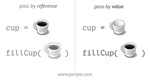

<<<<<<< HEAD
= Bilgisayarlı Görü ve Görüntü İşleme için Modern C ++
:TOC:

== 1. ÖZET

Bu seride derleme, hata ayıklama, fonksiyonlar, üstbilgi / kaynak ayrımı, kütüphaneler ve CMake'e giriş örneklerle anlatılmaktadır.

== 2. GİRİŞ

=== 2.1.Compilation flags(Derleme Bayrağı)

Kodu derlerken aldığımız hatalar sonucu bir çok compilation flags kullanırız.Komut satırına *c++ --help*
yazdığımızda kullanabileceğimiz bir cok parametreyi listelenmiş şekilde görürüz.

* En yaygın GCC ve Clang compilation flags(derleyici bayrakları):

** Std - C ++ sürümünü veya ISO standart sürümünü belirtir.

*** -std=c++11 (ISO C++11)
*** -std=c++14 (ISO C++14)
*** -std=c++1z (ISO C++17)
*** -std=c++20 (C++20 experimental)
*** -std=gnu++ (ISO C++ with GNU extensions)

** W uyarı anlamına gelir

*** -Wall

Çok sayıda derleyici uyarı işaretini döndürür, özellikle (-Waddress, -Wcomment, -Wformat, -Wbool-compare, -Wuninitialized, -Wunknown-pragmas, -Wunused-value, -Wunused-value …)

*** -Werror

Herhangi bir uyarıyı derleme hatasına dönüştürün.

[NOTE]
====
-w ile Tüm uyarı mesajlarını engelleyin.

-Wall, -Wextra, -Werror ile Tüm uyarıları etkinleştirin, hataları tespit edin.
====

** Optimizasyon seçenekleri:

*** -O0 - no optimizations
*** -O3 or -Ofast - full optimizations

Her iki komutta aynı işi yapar bazen biri diğerine göre daha hızlıdır, bunu kodunuzda denereyek öğrenebilirsiniz.

Eğer hata ayıklama yapmak için bir hata ayıklama aracı çalıştırmak istiyorsanız, hata ayıklama sembollerini tutmak için: **-g** kullanın.

[NOTE]
====
Kodda neler olup bittiğini anlamak için bir araç,
Compiler Explorer: https://godbolt.org/
====

=== 2.2.Hata Ayıklama Araçları

* En iyi seçenek gdb kullanmaktır
* Fazlasıyla popüler ve güçlü
* Dahili GUI yok
* Kullanıcı dostu bir arayüz için gdbgui kullanın
* Gdbgui'yi pip'ten yükleyin:
* sudo pip3 install - yükseltme gdbgui

Derleyici Gezgini ile çalıştırın: https://godbolt.org/

=== 2.3.Fonksiyonlar

[source, cpp]
----
1 ReturnType FuncName( ParamType1 in_1 , ParamType2 in_2) {
2 // Some awesome code here.
3 return return_value ;
4 }
----

* Kod fonksiyonlar ile organize edilebilir
* Fonksiyonlar bir kapsam(scope) oluşturur.
* Bir fonksiyonun bir dönüş değeri vardır
* Fonksiyonlar isimlendirilirken açık, anlaşılır adlandırma yapılmalı
* Adlandırmada GOOGLE-STYLE klavuzunda yer alan CamelCase kullanılır

.Kullanımı doğru olan fonksiyon örneği
[source, cpp]
----
1 #include <vector >
2 using namespace std;
3 vector <int> CreateVectorOfFullSquares (int size) {
4 vector <int> result(size); // Vector of size `size `
5 for (int i = 0; i < size; ++i) { result[i] = i * i; }
6 return result;
7 }
8
9 int main () {
10 auto squares = CreateVectorOfFullSquares (10);
11 return 0;
12 }
----

* Tüm kodu bir kerede anlaşılacak kadar yeterli mi
* İsimlendirme, işlevin ne yaptığını açıkça belirtir
* Fonksiyon tek bir şey yapar

.Kullanımı yanlış olan fonksiyon örneği
[source, cpp]
----
1 #include <vector >
2 using namespace std;
3 vector <int> Func(int a, bool b) {
4 if (b) { return vector <int >(10 , a); }
5 vector <int> vec(a);
6 for (int i = 0; i < a; ++i) { vec[i] = a * i; }
7 if (vec.size () > a * 2) { vec[a] /= 2.0f; }
8 return vec;
9 }
----

* Fonksiyonun adı hiçbir şey ifade etmiyor
* Değişkenlerin isimleri hiçbir şey ifade etmiyor
* Fonksiyonun tek bir amacı yok
* Fonksiyonlar belli bir işi yapan ve tekrar tekrar kullanılabilen işlemler topluluklarıdır.
* Fonksiyonları, programı anlamlı parçalara bölmek için ya da aynı kodun program içerisinde tekrar tekrar yazılmasını önlemek için kullanabiliriz.
* Fonksiyonlar değer döndürmek zorunda olmamakla birlikte genellikle değer döndürürler
* Fonksiyonlar çoğu arayüzde en kritik kısımdır, bu yüzden arayüz kurallarına dikkat edilmeli.

==== 2.3.1.Bildirim ve Tanımlama

[source, C++]
----
donus_turu fonksiyon_ismi(Parametreler)
{
    //Fonksiyonun yapacağı işlem
}
----
Bir fonksiyon kabaca yukarıdaki gibi tanımlanabilir.

*Dönüş Türü:* Fonksiyonların bir dönüş değeri olabilir tanımlamada kullanılan dönüş değeri, değerin veri türüdür.Bazı fonksiyonlar istenen işlemleri bir değer döndürmeden gerçekleştirir.

*Fonksiyon ismi:* Her fonksiyonun programda kullanılmak üzere bir ismi olmak zorundadır. Fonksiyon ismi, fonksiyonun işlevini de yansıtmalıdır.Fonksiyon isimlerinde kullanılması önerilen *camelCase* isimlendirme yöntemidir.

*Parametreler:* Her fonksiyon parametre almak zorunda değildir. İşlevine göre farklılık gösterir. Aldığı parametre belirtilirken değişken tanımlamada olduğu gibi önce parametrenin veri tipi daha sonra da ismi bildirilir. Her parametreye kendi veri türü belirtilmedilir.

*Fonksiyon Gövdesi:* Burada fonksiyonun yapacağı işlemler yazılır.**Fonksiyonlara bir den fazla iş verilmesi tavsiye edilmez.**

Bir fonksiyon programda kullanılmadan önce mutlaka protitipi veya gövdesiyle birlikte tanımlanmalıdır. Tanımlanmayan fonksiyon programda kullanılamaz.

.İyi tanımlanmış fonksiyon örneği
[source, C++]
----
1 #include <vector >
2 using namespace std;
3 vector <int> CreateVectorOfFullSquares (int size) {
4 vector <int> result(size); // Vector of size `size `
5 for (int i = 0; i < size; ++i) { result[i] = i * i; }
6 return result;
7 }
8
9 int main () {
10 auto squares = CreateVectorOfFullSquares (10);
11 return 0;
12 }
----

* Fonksiyonun adı fonksiyonun işlevi hakkında fikir verir.
* Değişken isimleri kodun okunabilirliğini artırır.
* Fonksiyonun tek bir görevi vardır.

.Kötü tanımlanmış fonksiyon örneği
[source, C++]
----
1 #include <vector >
2 using namespace std;
3 vector <int> Func(int a, bool b) {
4 if (b) { return vector <int >(10 , a); }
5 vector <int> vec(a);
6 for (int i = 0; i < a; ++i) { vec[i] = a * i; }
7 if (vec.size () > a * 2) { vec[a] /= 2.0f; }
8 return vec;
9 }
----

* Fonksiyonun adı fonksiyonun işlevi hakkında fikir vermez bir anlam ifade etmez.
* a, b gibi kısa değişken isimleri kodun okunabilirliğini azaltır.
* Fonksiyonun tek birden fazla görevi vardır.

==== 2.3.2 Fonksiyonların Çağrılması

* Pass by reference:
** void fillCup(Cup &cup);
** cup is full
* Pass by value:
** void fillCup(Cup cup);
** A copy of cup is full
** cup is still empty

[NOTE]
====
Pass by reference: Programlama dillerinde, fonksiyon çağırma işlemi sırasında kullanılan yöntemlerden birisidir. Farklı kaynaklarda atıf geçirme ( pass by reference ) olarak da geçmektedir. Genelde bir programlama dilinin standart çağrıma yöntemi değer ile çağırmadır (call by value) ancak gösterici (pointer) desteği olan dillerde bu standart çağırma yöntemine ilave olarak atıf ile çağırmak da mümkündür.

Bu yöntemde fonksiyona parametre (argüman) olarak bir değer geçirmek yerine bir gösterici (pointer) referansı geçirilir. Dolayısıyla fonksiyonun içindeki bir yerel değişken (local variable), fonksiyonun çağrıldığı yerdeki bir değeri göstermiş olur. Bu sayede fonksiyonda bu gösterici marifetiyle yapılan bütün işlemler fonksiyonun çağrılması sırasında parametre olarak verilen değer üzerine de etkili olur.

====

[source, C++]
----
#include <iostream>
using namespace std;
void f(int *p){
   *p=20;
}
int main(){
   int a=10;
   f(&a);
   cout<<a;
}
----
yukarıdaki kodda bulunan f fonksiyonuna a değişkeninin adresi (referansı) verilmiştir. Bu sayede f fonksiyonundaki parametre değişkeni olan p, a değişkeninin hafızadaki adresini göstermiş olur.

*Çözüm: Sabit referansları kullanın*

* İşleve const başvurusu iletin
* Bir referansı geçerken harika hız
* Geçilen nesne bozulmadan kalır

[source, C++]
----
1 void DoSmth(const std :: string& huge_string );
----

* Tüm fonksiyon argümanları için snake_case kullanın
* Sabit olmayan referanslar çoğunlukla C ++ 11'den önce yazılmış eski kodlarda kullanılır.
* Yararlı olabilirler ancak okunabilirliği bozarlar
* https://google.github.io/styleguide/cppguide.html#Reference_Arguments[GOOGLE-STYLE] Sabit olmayan referansları kullanmaktan kaçının

==== 2.3.3. Fonksiyon Aşırı Yükleme(Function Overloading)

* Derleyici, bağımsız değişkenlerden bir işlev çıkarır
* İade türüne göre aşırı yükleme yapılamaz
* Dönüş türü hiçbir rol oynamaz
* https://google.github.io/styleguide/cppguide.html#Reference_Arguments[GOOGLE-STYLE] Belirgin olmayan aşırı yüklemelerden kaçının

[source, C++]
----
 #include <iostream>
 #include <string >
 using namespace std;
 string Func(int num) { return "int"; }
 string Func(const string& str) { return "string"; }
 int main () {
 cout << Func (1) << endl;
 cout << Func("hello") << endl;
 return 0;
 }
----

[source, C++]
----
 #include <iostream> // std::cout , std::endl
 using namespace std;
 string SayHello(const string& to_whom = "world") {
 return "Hello " + to_whom + "!";
 }
 int main () {
 cout << SayHello () << endl;
 cout << SayHello("students") << endl;
 return 0;
 }
----

*Tekerleği yeniden icat etmeyin*

* std::vector, std::array, vb. kullanırken kendi fonksiyonlarınızı yazmaktan kaçınmaya çalışın.
* #İnclude <algorithm> kullanın

[source, C++]
----
 std :: vector <float > v;
 // Filling the vector omitted here.
 std :: sort(v.begin (), v.end ()); // Sort ascending.
 float sum = std :: accumulate (v.begin (), v.end (), 0.0f);
 float product = std :: accumulate (
 v.begin (), v.end (), 1.0f, std :: multiplies <float >());
----

=== 3. Üstbilgi / Kaynak Ayrımı(Header / Source Separation)

* Tüm bildirimleri başlık dosyalarına taşıyın (*.h) 
* Uygulama *.cpp veya *.cc'ye gider

[source, C++]
----
// some_file.h
 Type SomeFunc (... args ...);

 // some_file.cpp
 #include "some_file.h"
 Type SomeFunc (... args ...) { /* code */ }

 // program.cpp
 #include "some_file.h"
 int main () {
 SomeFunc(/* args */);
 return 0;
 }
----

=== 4. Bu nasıl inşa(build) edilir?
[source, C++]
----
1 folder/
2 --- tools.h
3 --- tools.cpp
4 --- main.cpp
----
Kısaca: kodu modüllere ayırıyoruz

*Beyan(Declaration): tools.h*
[source, C++]
----
#pragma once // Ensure file is included only once
 void MakeItSunny ();
 void MakeItRain ();
----

*Tanım(Definition): tools.cpp*
[source, C++]
----
 #include <iostream>
 #include "tools.h"
 void MakeItRain () {
 // important weather manipulation code
 std :: cout << "Here! Now it rains! Happy?\n";
 }
 void MakeItSunny () { std :: cerr << "Not available\n"; }
----

*Çağrı(Calling): main.cpp*
[source, C++]
----
#include "tools.h"
 int main () {
 MakeItRain ();
 MakeItSunny ();
 return 0;
 }
----

[NOTE]
====
Eskisi gibi mi inşa(build) edersiniz?

*c++ -std=c++11 main.cpp -o main*
====

[CAUTION]
====
*Error:*
[source, C++]
----
 /tmp/tools_main -0 eacf5.o: In function `main ':
 tools_main .cpp: undefined reference to `makeItRain ()'
 tools_main .cpp: undefined reference to `makeItSunny ()'
 clang: error: linker command failed with exit code 1
 (use -v to see invocation )
----
====

[NOTE]
====
*Modülleri ve kitaplıkları kullanın!*

Modülleri derleyin:
----
c++ -std=c++11 -c tools.cpp -o tools.o
----
Modülleri kitaplıklar halinde düzenleyin:
----
ar rcs libtools.a tools.o <other_modules>
----
Kod oluştururken kitaplıkları bağlayın:
----
c++ -std=c++11 main.cpp -L . -ltools -o main
----
Kodu çalıştırın:
----
./main
----
====

=== 5.Bağlanma(linking) nedir?

* Kitaplık, bazı yöntemlerin derlenmiş uygulamasını içeren ikili bir nesnedir
* Bağlama, bir işlev bildirimini derlenmiş uygulamasına eşler
* Bir kitaplığı kullanmak için bir başlığa ve derlenmiş kitaplık nesnesine ihtiyacımız var

=== 6. Oluşturmayı basitleştirmek için CMake kullanın
* En popüler derleme araçlarından biri
* Kodu oluşturmaz, bir yapı sistemine beslenecek dosyalar oluşturur
* Çapraz platform
* Çok güçlü, yine de inşa fişi okunabilir
* Kütüphane oluşturma ve bağlama aşağıdaki gibi yeniden yazılabilir:

[source, C++]
----
1 add_library(tools tools.cpp)
2 add_executable(main main.cpp)
3 target_link_libraries(main tools)
----

*Tipik proje yapısı*

[source, C++]
----
1 |-- project_name /
2 | |-- CMakeLists .txt
3 | |-- build/ # All generated build files
4 | |-- bin/
5 | | |-- tools_demo
6 | |-- lib/
7 | | |-- libtools.a
8 | |-- src/
9 | | |-- CMakeLists .txt
10 | | |-- project_name
11 | | |-- CMakeLists .txt
12 | | |-- tools.h
13 | | |-- tools.cpp
14 | | |-- tools_demo .cpp
15 | |-- tests/ # Tests for your code
16 | | |-- test_tools .cpp
17 | | |-- CMakeLists .txt
18 | |-- readme.md # How to use your code
----

*Derleme süreci*

* CMakeLists.txt tüm yapıyı tanımlar
* CMake, CMakeLists.txt dosyasını sırayla okur
* Build(İnşa) süreci:

[source,CMake]
----
1. cd <project_folder>
2. mkdir build
3. cd build
4. cmake ..
5. make -j2 # pass your number of cores here
----

=== 6. İlk çalışan CMakeLists.txt

[source,CMake]
----
1 project( first_project ) # Mandatory.
2 cmake_minimum_required(VERSION 3.1) # Mandatory.
3 set( CMAKE_CXX_STANDARD 11) # Use c++11.
4 # tell cmake to output binaries here:
5 set( EXECUTABLE_OUTPUT_PATH ${PROJECT_SOURCE_DIR}/bin)
6 set( LIBRARY_OUTPUT_PATH ${PROJECT_SOURCE_DIR}/lib)
7 # tell cmake where to look for *.h files
8 include_directories(${PROJECT_SOURCE_DIR}/src)
9 # create library "libtools"
10 add_library(tools src/tools.cpp)
11 # add executable main
12 add_executable(main src/ tools_main .cpp)
13 # tell the linker to bind these objects together
14 target_link_libraries(main tools)
----

== Referanslar

Compiler Explorer:
https://godbolt.org/

Gdbgui:
https://gdbgui.com/

Gdbgui tutorial:
https://www.youtube.com/watch?v=em842geJhfk

CMake website:
https://cmake.org/

Modern CMake Tutorial:
=======
= Bilgisayarlı Görü ve Görüntü İşleme için Modern C ++
:TOC:

== 1. ÖZET

Bu seride derleme, hata ayıklama, fonksiyonlar, üstbilgi / kaynak ayrımı, kütüphaneler ve CMake'e giriş örneklerle anlatılmaktadır.

== 2. GİRİŞ

=== 2.1.Compilation flags(Derleme Bayrağı)

Kodu derlerken aldığımız hatalar sonucu bir çok compilation flags kullanırız.Komut satırına *c++ --help*
yazdığımızda kullanabileceğimiz bir cok parametreyi listelenmiş şekilde görürüz.

* En yaygın GCC ve Clang compilation flags(derleyici bayrakları):

** Std - C ++ sürümünü veya ISO standart sürümünü belirtir.

*** -std=c++11 (ISO C++11)
*** -std=c++14 (ISO C++14)
*** -std=c++1z (ISO C++17)
*** -std=c++20 (C++20 experimental)
*** -std=gnu++ (ISO C++ with GNU extensions)

** W uyarı anlamına gelir

*** -Wall

Çok sayıda derleyici uyarı işaretini döndürür, özellikle (-Waddress, -Wcomment, -Wformat, -Wbool-compare, -Wuninitialized, -Wunknown-pragmas, -Wunused-value, -Wunused-value …)

*** -Werror

Herhangi bir uyarıyı derleme hatasına dönüştürün.

[NOTE]
====
-w ile Tüm uyarı mesajlarını engelleyin.

-Wall, -Wextra, -Werror ile Tüm uyarıları etkinleştirin, hataları tespit edin.
====

** Optimizasyon seçenekleri:

*** -O0 - no optimizations
*** -O3 or -Ofast - full optimizations

Her iki komutta aynı işi yapar bazen biri diğerine göre daha hızlıdır, bunu kodunuzda denereyek öğrenebilirsiniz.

Eğer hata ayıklama yapmak için bir hata ayıklama aracı çalıştırmak istiyorsanız, hata ayıklama sembollerini tutmak için: **-g** kullanın.

[NOTE]
====
Kodda neler olup bittiğini anlamak için bir araç,
Compiler Explorer: https://godbolt.org/
====

=== 2.2.Hata Ayıklama Araçları

* En iyi seçenek gdb kullanmaktır
* Fazlasıyla popüler ve güçlü
* Dahili GUI yok
* Kullanıcı dostu bir arayüz için gdbgui kullanın
* Gdbgui'yi pip'ten yükleyin:
* sudo pip3 install - yükseltme gdbgui

Derleyici Gezgini ile çalıştırın: https://godbolt.org/

=== 2.3.Fonksiyonlar

[source, cpp]
----
1 ReturnType FuncName( ParamType1 in_1 , ParamType2 in_2) {
2 // Some awesome code here.
3 return return_value ;
4 }
----

* Kod fonksiyonlar ile organize edilebilir
* Fonksiyonlar bir kapsam(scope) oluşturur.
* Bir fonksiyonun bir dönüş değeri vardır
* Fonksiyonlar isimlendirilirken açık, anlaşılır adlandırma yapılmalı
* Adlandırmada GOOGLE-STYLE klavuzunda yer alan CamelCase kullanılır

.Kullanımı doğru olan fonksiyon örneği
[source, cpp]
----
1 #include <vector >
2 using namespace std;
3 vector <int> CreateVectorOfFullSquares (int size) {
4 vector <int> result(size); // Vector of size `size `
5 for (int i = 0; i < size; ++i) { result[i] = i * i; }
6 return result;
7 }
8
9 int main () {
10 auto squares = CreateVectorOfFullSquares (10);
11 return 0;
12 }
----

* Tüm kodu bir kerede anlaşılacak kadar yeterli mi
* İsimlendirme, işlevin ne yaptığını açıkça belirtir
* Fonksiyon tek bir şey yapar

.Kullanımı yanlış olan fonksiyon örneği
[source, cpp]
----
1 #include <vector >
2 using namespace std;
3 vector <int> Func(int a, bool b) {
4 if (b) { return vector <int >(10 , a); }
5 vector <int> vec(a);
6 for (int i = 0; i < a; ++i) { vec[i] = a * i; }
7 if (vec.size () > a * 2) { vec[a] /= 2.0f; }
8 return vec;
9 }
----

* Fonksiyonun adı hiçbir şey ifade etmiyor
* Değişkenlerin isimleri hiçbir şey ifade etmiyor
* Fonksiyonun tek bir amacı yok
* Fonksiyonlar belli bir işi yapan ve tekrar tekrar kullanılabilen işlemler topluluklarıdır.
* Fonksiyonları, programı anlamlı parçalara bölmek için ya da aynı kodun program içerisinde tekrar tekrar yazılmasını önlemek için kullanabiliriz.
* Fonksiyonlar değer döndürmek zorunda olmamakla birlikte genellikle değer döndürürler
* Fonksiyonlar çoğu arayüzde en kritik kısımdır, bu yüzden arayüz kurallarına dikkat edilmeli.

==== 2.3.1.Bildirim ve Tanımlama

[source, C++]
----
donus_turu fonksiyon_ismi(Parametreler)
{
    //Fonksiyonun yapacağı işlem
}
----
Bir fonksiyon kabaca yukarıdaki gibi tanımlanabilir.

*Dönüş Türü:* Fonksiyonların bir dönüş değeri olabilir tanımlamada kullanılan dönüş değeri, değerin veri türüdür.Bazı fonksiyonlar istenen işlemleri bir değer döndürmeden gerçekleştirir.

*Fonksiyon ismi:* Her fonksiyonun programda kullanılmak üzere bir ismi olmak zorundadır. Fonksiyon ismi, fonksiyonun işlevini de yansıtmalıdır.Fonksiyon isimlerinde kullanılması önerilen *camelCase* isimlendirme yöntemidir.

*Parametreler:* Her fonksiyon parametre almak zorunda değildir. İşlevine göre farklılık gösterir. Aldığı parametre belirtilirken değişken tanımlamada olduğu gibi önce parametrenin veri tipi daha sonra da ismi bildirilir. Her parametreye kendi veri türü belirtilmedilir.

*Fonksiyon Gövdesi:* Burada fonksiyonun yapacağı işlemler yazılır.**Fonksiyonlara bir den fazla iş verilmesi tavsiye edilmez.**

Bir fonksiyon programda kullanılmadan önce mutlaka protitipi veya gövdesiyle birlikte tanımlanmalıdır. Tanımlanmayan fonksiyon programda kullanılamaz.

.İyi tanımlanmış fonksiyon örneği
[source, C++]
----
1 #include <vector >
2 using namespace std;
3 vector <int> CreateVectorOfFullSquares (int size) {
4 vector <int> result(size); // Vector of size `size `
5 for (int i = 0; i < size; ++i) { result[i] = i * i; }
6 return result;
7 }
8
9 int main () {
10 auto squares = CreateVectorOfFullSquares (10);
11 return 0;
12 }
----

* Fonksiyonun adı fonksiyonun işlevi hakkında fikir verir.
* Değişken isimleri kodun okunabilirliğini artırır.
* Fonksiyonun tek bir görevi vardır.

.Kötü tanımlanmış fonksiyon örneği
[source, C++]
----
1 #include <vector >
2 using namespace std;
3 vector <int> Func(int a, bool b) {
4 if (b) { return vector <int >(10 , a); }
5 vector <int> vec(a);
6 for (int i = 0; i < a; ++i) { vec[i] = a * i; }
7 if (vec.size () > a * 2) { vec[a] /= 2.0f; }
8 return vec;
9 }
----

* Fonksiyonun adı fonksiyonun işlevi hakkında fikir vermez bir anlam ifade etmez.
* a, b gibi kısa değişken isimleri kodun okunabilirliğini azaltır.
* Fonksiyonun tek birden fazla görevi vardır.

==== 2.3.2 Fonksiyonların Çağrılması

* Pass by reference:
** void fillCup(Cup &cup);
** cup is full
* Pass by value:
** void fillCup(Cup cup);
** A copy of cup is full
** cup is still empty

[NOTE]
====
Pass by reference: Programlama dillerinde, fonksiyon çağırma işlemi sırasında kullanılan yöntemlerden birisidir. Farklı kaynaklarda atıf geçirme ( pass by reference ) olarak da geçmektedir. Genelde bir programlama dilinin standart çağrıma yöntemi değer ile çağırmadır (call by value) ancak gösterici (pointer) desteği olan dillerde bu standart çağırma yöntemine ilave olarak atıf ile çağırmak da mümkündür.

Bu yöntemde fonksiyona parametre (argüman) olarak bir değer geçirmek yerine bir gösterici (pointer) referansı geçirilir. Dolayısıyla fonksiyonun içindeki bir yerel değişken (local variable), fonksiyonun çağrıldığı yerdeki bir değeri göstermiş olur. Bu sayede fonksiyonda bu gösterici marifetiyle yapılan bütün işlemler fonksiyonun çağrılması sırasında parametre olarak verilen değer üzerine de etkili olur.

====

[source, C++]
----
#include <iostream>
using namespace std;
void f(int *p){
   *p=20;
}
int main(){
   int a=10;
   f(&a);
   cout<<a;
}
----
yukarıdaki kodda bulunan f fonksiyonuna a değişkeninin adresi (referansı) verilmiştir. Bu sayede f fonksiyonundaki parametre değişkeni olan p, a değişkeninin hafızadaki adresini göstermiş olur.

*Çözüm: Sabit referansları kullanın*

* İşleve const başvurusu iletin
* Bir referansı geçerken harika hız
* Geçilen nesne bozulmadan kalır

[source, C++]
----
1 void DoSmth(const std :: string& huge_string );
----

* Tüm fonksiyon argümanları için snake_case kullanın
* Sabit olmayan referanslar çoğunlukla C ++ 11'den önce yazılmış eski kodlarda kullanılır.
* Yararlı olabilirler ancak okunabilirliği bozarlar
* https://google.github.io/styleguide/cppguide.html#Reference_Arguments[GOOGLE-STYLE] Sabit olmayan referansları kullanmaktan kaçının

==== 2.3.3. Fonksiyon Aşırı Yükleme(Function Overloading)

* Derleyici, bağımsız değişkenlerden bir işlev çıkarır
* İade türüne göre aşırı yükleme yapılamaz
* Dönüş türü hiçbir rol oynamaz
* https://google.github.io/styleguide/cppguide.html#Reference_Arguments[GOOGLE-STYLE] Belirgin olmayan aşırı yüklemelerden kaçının

[source, C++]
----
 #include <iostream>
 #include <string >
 using namespace std;
 string Func(int num) { return "int"; }
 string Func(const string& str) { return "string"; }
 int main () {
 cout << Func (1) << endl;
 cout << Func("hello") << endl;
 return 0;
 }
----

[source, C++]
----
 #include <iostream> // std::cout , std::endl
 using namespace std;
 string SayHello(const string& to_whom = "world") {
 return "Hello " + to_whom + "!";
 }
 int main () {
 cout << SayHello () << endl;
 cout << SayHello("students") << endl;
 return 0;
 }
----

*Tekerleği yeniden icat etmeyin*

* std::vector, std::array, vb. kullanırken kendi fonksiyonlarınızı yazmaktan kaçınmaya çalışın.
* #İnclude <algorithm> kullanın

[source, C++]
----
 std :: vector <float > v;
 // Filling the vector omitted here.
 std :: sort(v.begin (), v.end ()); // Sort ascending.
 float sum = std :: accumulate (v.begin (), v.end (), 0.0f);
 float product = std :: accumulate (
 v.begin (), v.end (), 1.0f, std :: multiplies <float >());
----

=== 3. Üstbilgi / Kaynak Ayrımı(Header / Source Separation)

* Tüm bildirimleri başlık dosyalarına taşıyın (*.h) 
* Uygulama *.cpp veya *.cc'ye gider

[source, C++]
----
// some_file.h
 Type SomeFunc (... args ...);

 // some_file.cpp
 #include "some_file.h"
 Type SomeFunc (... args ...) { /* code */ }

 // program.cpp
 #include "some_file.h"
 int main () {
 SomeFunc(/* args */);
 return 0;
 }
----

=== 4. Bu nasıl inşa(build) edilir?
[source, C++]
----
1 folder/
2 --- tools.h
3 --- tools.cpp
4 --- main.cpp
----
Kısaca: kodu modüllere ayırıyoruz

*Beyan(Declaration): tools.h*
[source, C++]
----
#pragma once // Ensure file is included only once
 void MakeItSunny ();
 void MakeItRain ();
----

*Tanım(Definition): tools.cpp*
[source, C++]
----
 #include <iostream>
 #include "tools.h"
 void MakeItRain () {
 // important weather manipulation code
 std :: cout << "Here! Now it rains! Happy?\n";
 }
 void MakeItSunny () { std :: cerr << "Not available\n"; }
----

*Çağrı(Calling): main.cpp*
[source, C++]
----
#include "tools.h"
 int main () {
 MakeItRain ();
 MakeItSunny ();
 return 0;
 }
----

[NOTE]
====
Eskisi gibi mi inşa(build) edersiniz?

*c++ -std=c++11 main.cpp -o main*
====

[CAUTION]
====
*Error:*
[source, C++]
----
 /tmp/tools_main -0 eacf5.o: In function `main ':
 tools_main .cpp: undefined reference to `makeItRain ()'
 tools_main .cpp: undefined reference to `makeItSunny ()'
 clang: error: linker command failed with exit code 1
 (use -v to see invocation )
----
====

[NOTE]
====
*Modülleri ve kitaplıkları kullanın!*

Modülleri derleyin:
----
c++ -std=c++11 -c tools.cpp -o tools.o
----
Modülleri kitaplıklar halinde düzenleyin:
----
ar rcs libtools.a tools.o <other_modules>
----
Kod oluştururken kitaplıkları bağlayın:
----
c++ -std=c++11 main.cpp -L . -ltools -o main
----
Kodu çalıştırın:
----
./main
----
====

=== 5.Bağlanma(linking) nedir?

* Kitaplık, bazı yöntemlerin derlenmiş uygulamasını içeren ikili bir nesnedir
* Bağlama, bir işlev bildirimini derlenmiş uygulamasına eşler
* Bir kitaplığı kullanmak için bir başlığa ve derlenmiş kitaplık nesnesine ihtiyacımız var

=== 6. Oluşturmayı basitleştirmek için CMake kullanın
* En popüler derleme araçlarından biri
* Kodu oluşturmaz, bir yapı sistemine beslenecek dosyalar oluşturur
* Çapraz platform
* Çok güçlü, yine de inşa fişi okunabilir
* Kütüphane oluşturma ve bağlama aşağıdaki gibi yeniden yazılabilir:

[source, C++]
----
1 add_library(tools tools.cpp)
2 add_executable(main main.cpp)
3 target_link_libraries(main tools)
----

*Tipik proje yapısı*

[source, C++]
----
1 |-- project_name /
2 | |-- CMakeLists .txt
3 | |-- build/ # All generated build files
4 | |-- bin/
5 | | |-- tools_demo
6 | |-- lib/
7 | | |-- libtools.a
8 | |-- src/
9 | | |-- CMakeLists .txt
10 | | |-- project_name
11 | | |-- CMakeLists .txt
12 | | |-- tools.h
13 | | |-- tools.cpp
14 | | |-- tools_demo .cpp
15 | |-- tests/ # Tests for your code
16 | | |-- test_tools .cpp
17 | | |-- CMakeLists .txt
18 | |-- readme.md # How to use your code
----

*Derleme süreci*

* CMakeLists.txt tüm yapıyı tanımlar
* CMake, CMakeLists.txt dosyasını sırayla okur
* Build(İnşa) süreci:

[source,CMake]
----
1. cd <project_folder>
2. mkdir build
3. cd build
4. cmake ..
5. make -j2 # pass your number of cores here
----

=== 6. İlk çalışan CMakeLists.txt

[source,CMake]
----
1 project( first_project ) # Mandatory.
2 cmake_minimum_required(VERSION 3.1) # Mandatory.
3 set( CMAKE_CXX_STANDARD 11) # Use c++11.
4 # tell cmake to output binaries here:
5 set( EXECUTABLE_OUTPUT_PATH ${PROJECT_SOURCE_DIR}/bin)
6 set( LIBRARY_OUTPUT_PATH ${PROJECT_SOURCE_DIR}/lib)
7 # tell cmake where to look for *.h files
8 include_directories(${PROJECT_SOURCE_DIR}/src)
9 # create library "libtools"
10 add_library(tools src/tools.cpp)
11 # add executable main
12 add_executable(main src/ tools_main .cpp)
13 # tell the linker to bind these objects together
14 target_link_libraries(main tools)
----

== Referanslar

Compiler Explorer:
https://godbolt.org/

Gdbgui:
https://gdbgui.com/

Gdbgui tutorial:
https://www.youtube.com/watch?v=em842geJhfk

CMake website:
https://cmake.org/

Modern CMake Tutorial:
>>>>>>> fe3be6150d3b2a03dafcbde687e479d82fb25042
https://www.youtube.com/watch?v=eC9-iRN2b04