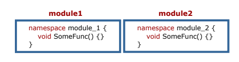

= Bilgisayarlı Görü ve Görüntü İşleme için Modern C ++
:TOC:

== 1. ÖZET

Bu seride Google Test, Namespaces, Classes giriş örneklerle anlatılmaktadır.

== 2. Google Test

=== Fonksiyonlarınızı test etmek için GTest'i kullanın

* Hataları daha az acı ile düzeltmek için erken yakalayın
* Hataları erken yakalamak için test yapmak çok önemlidir
* Test edilen işlevlere güvenmek daha kolaydır
* Her işlev için en az iki test yazın
** Normal durumlar için bir tane
** Ekstrem durumlar için bir tane

*Yazma testlerini alışkanlık haline getirin*

=== Testler nasıl görünüyor?

* Tek bir yapay Google testi:

[source,output]
----
1 TEST(TestModule , FunctionName ) {
2 EXPECT_EQ (4, FunctionName ());
3 }
----

* Başarılı çıktı:
[source,output]
----
1 Running main () from gtest_main .cc
2 [==========] Running 1 test from 1 test case.
3 [----------] Global test environment set -up.
4 [----------] 1 test from TesModule
5 [ RUN ] TesModule . FunctionName
6 [ OK ] TesModule . FunctionName (0 ms)
7 [----------] 1 test from TesModule (0 ms total)
8
9 [----------] Global test environment tear -down
10 [==========] 1 test from 1 test case ran.
11 [ PASSED ] 1 test.

----

=== CMake ile GTest'ler ekleyin

* GTest kaynak dosyalarını yükleyin (daha sonra oluşturun):

[source,bash]
----
Sudo apt libgtest-dev yükle
----

* CMake projenize klasör testleri ekleyin:

[source,CMake]
----
1 # Must be in the top-most CMakeLists.txt file.
2 enable_testing ()
3 # Outsource tests to another folder.
4 add_subdirectory(tests)
----
=== Testleri yapılandırın
[source,CMake]
----
1 # Add gtest sources folder. Provides gtest , gtest_main.
2 add_subdirectory(/ usr/src/gtest
3 ${PROJECT_BINARY_DIR}/gtest)
4 include(CTest) # Include testing cmake package.
5 # Set binary name for convenience.
6 set( TEST_BINARY ${PROJECT_NAME}_test)
7 # This is an executable that runs the tests.
8 add_executable(${TEST_BINARY} test_tools .cpp)
9 # Link the executable to needed libraries.
10 target_link_libraries(${TEST_BINARY}
11 tools # Library we are testing
12 gtest gtest_main # GTest libraries
13 )
14 # Add gtest to be able to run ctest
15 add_test(
16 NAME ${TEST_BINARY}
17 COMMAND ${EXECUTABLE_OUTPUT_PATH}/${TEST_BINARY})
----

=== Testlerinizi çalıştırın
* Kodunuzu eskisi gibi oluşturun
* Oluşturduktan sonra bir adım daha ekleyin
[source,Bash]
----
1. cd <project_folder>
2. mkdir build
3. cd build
4. cmake ..
5. make
6. ctest -VV
----

== 3. Namespaces

* İsim çatışmalarını önlemeye yardımcı olur
* Projeyi mantıksal modüller halinde gruplayın

=== Namespaces Örnekleri

[source, C++]
----
1 #include <iostream >
2
3 namespace fun {
4 int GetMeaningOfLife () { return 42; }
5 } // namespace fun
6
7 namespace boring {
8 int GetMeaningOfLife () { return 0; }
9 } // namespace boring
10
11 int main () {
12 std :: cout << "The answer to everything is not "
13 << boring :: GetMeaningOfLife () << " but "
14 << fun :: GetMeaningOfLife () << std :: endl;
15 return 0;
16 }
----

=== using namespace <name> Kullanmaktan Kaçının
[source, C++]
----
1 #include <cmath >
2 #include <iostream >
3 using namespace std; // std namespace is used
4 // Self -defined function power shadows std::pow
5 double pow(double x, int exp) {
6 double res = 1.0;
7 for (int i = 0; i < exp; i++) { res *= x; }
8 cout << "Our cool power function\n";
9 return (res);
10 }
11 int main () {
12 double x = 2.0;
13 int power = 2;
14 double res = pow(x, power);
15 cout << x << " ^ " << power << " = " << res << endl;
16 return 0;
17 }
----

=== Namespace error

*Error output:*
[source,output]
----
1 /home/igor /.../ namespaces_error .cpp :13:26:
2 error: call of overloaded ‘pow(double&, int&)’ is
ambiguous
3 double res = pow(x, exp);
4 ^
5 ...
----

=== Sadece ihtiyacınız olanı kullanın
[source,C++]
----
1 #include <cmath >
2 #include <iostream >
3 using std :: cout; // Explicitly use cout.
4 using std :: endl; // Explicitly use endl.
5 // Self -defined function power shadows std::pow
6 double pow(double x, int exp) {
7 double res = 1.0;
8 for (int i = 0; i < exp; i++) { res *= x; }
9 cout << "Our cool power function\n";
10 return (res);
11 }
12 int main () {
13 double x = 2.0;
14 int power = 2;
15 double res = pow(x, power);
16 cout << x << " ^ " << power << " = " << res << endl;
17 return 0;
18 }
----

=== Namespace Özeti

* Ad çakışmalarını önlemek için *Namespace* kullanın
[source,C++]
----
1 namespace some_name {
2 <your_code >
3 } // namespace some_name
----

* Doğru kullanıma dikkat edin!
[source,C++]
----
using my_namespace::myFunc;
my_namespace::myFunc(…);
----
* .h dosyalarında asla ad alanı adını kullanmayın 
* .cpp dosyalarında bile açık kullanmayı tercih edin(Prefer using explicit using even in *.cpp files)

=== İsimsiz Namespace

Kendinizi bir dosyadaki bazı bileşenlere güvenirken bulursanız ve bu sabitler başka bir dosyada görülmemesi gerekiyorsa, bunları bu dosyanın en üstündeki isimsiz bir namespace'e koyun.
[source,C++]
----
1 namespace {
2 const int kLocalImportantInt = 13;
3 const float kLocalImportantFloat = 13.0f;
4 } // namespace
----

== Referanslar