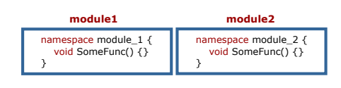

= Bilgisayarlı Görü ve Görüntü İşleme için Modern C ++
:TOC:

== 1. ÖZET

Bu seride Google Test, Namespaces, Classes giriş örneklerle anlatılmaktadır.

== 2. Google Test

=== 2.1 Fonksiyonlarınızı test etmek için GTest'i kullanın

* Hataları daha az acı ile düzeltmek için erken yakalayın
* Hataları erken yakalamak için test yapmak çok önemlidir
* Test edilen işlevlere güvenmek daha kolaydır
* Her işlev için en az iki test yazın
** Normal durumlar için bir tane
** Ekstrem durumlar için bir tane

*Yazma testlerini alışkanlık haline getirin*

=== 2.2 Testler nasıl görünüyor?

* Tek bir yapay Google testi:

[source,output]
----
1 TEST(TestModule , FunctionName ) {
2 EXPECT_EQ (4, FunctionName ());
3 }
----

* Başarılı çıktı:

[source,C++]
----
1 Running main () from gtest_main .cc
2 [==========] Running 1 test from 1 test case.
3 [----------] Global test environment set -up.
4 [----------] 1 test from TesModule
5 [ RUN ] TesModule . FunctionName
6 [ OK ] TesModule . FunctionName (0 ms)
7 [----------] 1 test from TesModule (0 ms total)
8
9 [----------] Global test environment tear -down
10 [==========] 1 test from 1 test case ran.
11 [ PASSED ] 1 test.

----

=== 2.3 CMake ile GTest'ler ekleyin

* GTest kaynak dosyalarını yükleyin (daha sonra oluşturun):

[source,bash]
----
Sudo apt libgtest-dev yükle
----

* CMake projenize klasör testleri ekleyin:

[source,CMake]
----
1 # Must be in the top-most CMakeLists.txt file.
2 enable_testing ()
3 # Outsource tests to another folder.
4 add_subdirectory(tests)
----
=== 2.4 Testleri yapılandırın
[source,CMake]
----
 # Add gtest sources folder. Provides gtest , gtest_main.
 add_subdirectory(/ usr/src/gtest
 ${PROJECT_BINARY_DIR}/gtest)
 include(CTest) # Include testing cmake package.
 # Set binary name for convenience.
 set( TEST_BINARY ${PROJECT_NAME}_test)
 # This is an executable that runs the tests.
 add_executable(${TEST_BINARY} test_tools .cpp)
 # Link the executable to needed libraries.
 target_link_libraries(${TEST_BINARY}
 tools # Library we are testing
 gtest gtest_main # GTest libraries
 )
 # Add gtest to be able to run ctest
 add_test(
 NAME ${TEST_BINARY}
 COMMAND ${EXECUTABLE_OUTPUT_PATH}/${TEST_BINARY})
----

=== 2.4 Testlerinizi çalıştırın
* Kodunuzu eskisi gibi oluşturun
* Oluşturduktan sonra bir adım daha ekleyin
[source,Bash]
----
1. cd <project_folder>
2. mkdir build
3. cd build
4. cmake ..
5. make
6. ctest -VV
----

== 3. Namespaces

* İsim çatışmalarını önlemeye yardımcı olur
* Projeyi mantıksal modüller halinde gruplayın

=== 3.1 Namespaces Örnekleri

[source, C++]
----
 #include <iostream>

 namespace fun {
 int GetMeaningOfLife () { return 42; }
 } // namespace fun

 namespace boring {
 int GetMeaningOfLife () { return 0; }
 } // namespace boring

 int main () {
 std :: cout << "The answer to everything is not "
 << boring :: GetMeaningOfLife () << " but "
 << fun :: GetMeaningOfLife () << std :: endl;
 return 0;
 }
----

=== 3.2 using namespace <name> Kullanmaktan Kaçının
[source, C++]
----
 #include <cmath >
 #include <iostream >
 using namespace std; // std namespace is used
 // Self -defined function power shadows std::pow
 double pow(double x, int exp) {
 double res = 1.0;
 for (int i = 0; i < exp; i++) { res *= x; }
 cout << "Our cool power function\n";
 return (res);
 }
 int main () {
 double x = 2.0;
 int power = 2;
 double res = pow(x, power);
 cout << x << " ^ " << power << " = " << res << endl;
 return 0;
 }
----

=== 3.2 Namespace error

*Error output:*
[source,C++]
----
1 /home/igor /.../ namespaces_error .cpp :13:26:
2 error: call of overloaded ‘pow(double&, int&)’ is
ambiguous
3 double res = pow(x, exp);
4 ^
5 ...
----

=== 3.3 Sadece ihtiyacınız olanı kullanın
[source,C++]
----
 #include <cmath >
 #include <iostream >
 using std :: cout; // Explicitly use cout.
 using std :: endl; // Explicitly use endl.
 // Self -defined function power shadows std::pow
 double pow(double x, int exp) {
 double res = 1.0;
 for (int i = 0; i < exp; i++) { res *= x; }
 cout << "Our cool power function\n";
 return (res);
 }
 int main () {
 double x = 2.0;
 int power = 2;
 double res = pow(x, power);
 cout << x << " ^ " << power << " = " << res << endl;
 return 0;
 }
----

=== 3.4 Namespace Özeti

* Ad çakışmalarını önlemek için *Namespace* kullanın
[source,C++]
----
 namespace some_name {
 <your_code >
 } // namespace some_name
----

* Doğru kullanıma dikkat edin!
[source,C++]
----
using my_namespace::myFunc;
my_namespace::myFunc(…);
----
* .h dosyalarında asla ad alanı adını kullanmayın 
* .cpp dosyalarında bile açık kullanmayı tercih edin(Prefer using explicit using even in *.cpp files)

=== 3.5 İsimsiz Namespace

Kendinizi bir dosyadaki bazı bileşenlere güvenirken bulursanız ve bu sabitler başka bir dosyada görülmemesi gerekiyorsa, bunları bu dosyanın en üstündeki isimsiz bir namespace'e koyun.
[source,C++]
----
 namespace {
 const int kLocalImportantInt = 13;
 const float kLocalImportantFloat = 13.0f;
 } // namespace
----

== 4. Sınıflar ve yapılar ile yeni türler oluşturun
* Sınıflar, verileri işlemek için fonksiyonlarla birlikte kapsüllemek için kullanılır
* Her sınıf veya yapı yeni bir türü tanımlar
* Sınıflar, C ++ 'nın Nesne Tabanlı Programlama dili olarak kullanılmasına izin verir
* String, vector, vb. tüm sınıflardır

=== 4.1 Örnek sınıf tanımı

[source,C++]
----
 class Image {
 public:
 Image(const std :: string& file_name );
 void Draw ();
 private:
 int rows_ = 0;
 int cols_ = 0;
 };
 // Implementation omitted here.
 int main () {
 Image image("some_image.pgm");
 image.Draw ();
 return 0;
 }
----

=== 4.2 Sınıflar sözdizimi(Classes syntax)
* Tanılama sınıfı anahtar kelimesi ile başlar
* Sınıfların üç erişim değiştiricisi vardır: *private, protected* ve *public*
* Varsayılan olarak her şey *private*
dir
* Sınıflar veri ve fonksiyonlar içerebilir
* Üyelere '.' İle erişin
* İki tür özel fonksiyona sahiptirler:
** Contructors: sınıfın bir örneğinin oluşturulması çağrısında bulundu
** Destructor: sınıfın bir örneğinin yok edilmesi çağrısında bulundu
* https://google.github.io/styleguide/cppguide.html#Type_Names[GOOGLE-STYLE] Sınıf adı için CamelCase kullanın

=== 4.3 structs(yapılar) ne olacak?

* Tanımlama struct anahtar kelime yapısı ile başlar:

[source,C++]
----
 struct ExampleStruct {
 Type value;
 Type value;
 Type value;
 // No functions!
 };
----
* Struct her şeyin herkese açık olduğu bir *public  sınıftır*.

[source,C++]
----
 #include <iostream >
 #include <string >
 using namespace std;
 // Define a structure.
 struct NamedInt {
 int num;
 string name;
 };
 void PrintStruct (const NamedInt& s) {
 cout << s.name << " " << s.num << endl;
 }
 int main(int argc , char const* argv []) {
 NamedInt var = {1, "hello"};
 PrintStruct (var);
 PrintStruct ({10 , "world"});
 return 0;
 }
----

==== 4.4 Bir sınıfta depolanan veriler

* Sınıflar her türden veriyi depolayabilir
* https://google.github.io/styleguide/cppguide.html#Access_Control[GOOGLE-STYLE] Tüm veriler *private* olmalıdır 
* https://google.github.io/styleguide/cppguide.html#Variable_Names[GOOGLE-STYLE] Özel veri üyeleri için snake_case_ ve '_' kullanın
* Veriler Contructors'da ayarlanmalıdır
* erekirse Destructor'daki verileri temizleyin

==== 4.5 Constructors and Destructor

* Constructor fonksiyonu, nesne oluşturulduğunda ilk çalışacak fonksiyondur. Class ile aynı isimde olmak zorundadır. Constructor herhangi bir tipte değildir.
* Constructor ile hızlı yolla ilk değer atama işlemine dair aşağıda örnek verilmiştir.

[source,C++]
----
#include <iostream>
using namespace std;
#define SINIF_MEVCUDU 2
class Basit{
    int i;
    float f;
    public:
        // Sadece prototip olarak yazıo bıraktık.
        Basit(int, float);
        // Deger fonksiyonu ile ekrana çıktıyı bastırdık.
        void deger(){cout<<i<<f;};
};
// 1. Yöntem: Nesne oluşturulduğunda değerlere atama yaptık.
Basit::Basit(int a,float b):i(a),f(b){}
// 2. Yöntem : Hatta ilk atama ile içeriye değer de yazabiliriz.
Basit::Basit(int a, float b):i(a),float(b){
    cout << "Burası ilk ekrana bastırılacak alan";
}
// 3.Yöntem: Uzun yol
Basit::Basit(int a, float b){
    i = a;
    f = b;
};
int main(){
    Basit nsn(1,2.5);
    nsn.deger();
    return 0;
}
----
[WARNING]
====
Kodu direk yapıştırırsanız ve çalıştırırsanız redefinition hatası alırsınız. Bu hatayı almanızın sebebi ise aynı kod parçasını 3 farklı yöntem ile yazdım. Kodu çalıştırmak için İlk atama yöntemi 1 2 veya 3'ü silmelisiniz.
====

===== 4.5.1 Yapıcı Fonksiyonlarda Overloading
Öncelikle bir eleman class’ı tanımlayalım. İçerisinde iki adet yapıcı fonksiyon bulunuyor. Birincisi boş ve bir işlem yapmıyor. İkincisi int ve string olarak parametre gönderildiğinde çalışacak olanıdır.

[source,C++]
----
class Eleman{
    int no;
    string isim;
    
    public:
        Eleman(){}; // Birinci yapıcı fonksiyonum
        Eleman(int,string); // İkinci yapıcı fonksiyonum
        
        void noAta(int _no){no = _no;}
        int noAl(){return no;}
        void isimAta(string _isim){isim = _isim;}
        string isimAl(){return isim;}
        void yaz(){
            cout<<"isim"<<isim<<"No"<<no;
        }
};
// Constructor'ı çalıştıralım
Eleman::Eleman(int i, string s):no(i),isim(s){};
----

Şimdi ise main fonksiyonumuza bir göz atalım.

Sonuç olarak bir göz atacak olursak. Overloading yaparak aslında şunu belirtmiş olduk. Nesne oluşturulduğunda otomatik benim verdiğim değerler ile işlemi başlat dersek içi boş constructor çalıştırılacak tersi durumda mesela içerisine 2 adet parametre gönderileceği zamanda ise öteki constructor çalıştırılacaktır.
[source,C++]
----
int main(){
    // Yapıcı fonksiyonu boş olan bir nesne oluşturalım ad e1 olsun.
    Eleman e1;
    // Yapıcı fonksiyonu dolu olan ve atama işlemi yapan bir nesne oluşturalım adı e2 olsun.
    // Otomatik olarak değerler dolar.
    Eleman e2(123,"Ali");
    
    // Değişkenlerimizi bilgi toplamak için oluşturalım.
    int no;
    string isim;
    
    // Bilgileri klavyeden çekelim.
    cout<<"Elemanın numara ve ismini giriniz.";
    cin>>no>>isim;
    
    // E1 nesnesi içerisindeki noAta methodunu çalıştırarak nesnenin içerisindeki no bilgisini dolduralım.
    e1.noAta(no);
    // Aynı şekilde isim bilgisinide dolduralım.
    e1.isimAta(isim);
    
    e1.yaz();
    e2.yaz();
    return 0;
}
----

==== 4.6 Yıkıcı Fonksiyonlar (Destructor)

Bir nesne yok edilmeden hemen önce yıkıcı fonksiyon çalışır. Buna örnek vermek gerekirse. Php’de genelde işlemler şöyle yapılır. Constructor içerisinde mysql connect işlemleri yapılır. Destructor içerisinde ise mysqli kapatma işlemleri yapılır.

Yıkıcı fonksiyon yazarken *~* bu işlem ile başlıyor. Bu işareti yapabilmek için kendi klavyeme göre söylemek gerekirse. AltGr ve ü işaretine basmak gerekiyor.

Kullanımına kısa bir örnek vermek gerekirse.
[source,C++]
----
// Public altında aşağıda ki şekilde tanımlayabilirisiniz. 
~MySQLConnect();
// Düzenlemek isterseniz. Yine aynı constructor içerisinde //yaptığımızı yapıyoruz. Tek fark başına ~ bu işareti ekliyoruz.
MySQLConnect::~MySQLConnect(){
    "Yıkıcı fonksiyon";
};
----

==== 4.7 Örnek oluşturmanın birçok yolu
[source,C++]
----
 class SomeClass {
 public:
 SomeClass (); // Default constructor.
 SomeClass (int a); // Custom constructor.
 SomeClass (int a, float b); // Custom constructor.
 ~ SomeClass (); // Destructor.
 };
 // How to use them?
 int main () {
 SomeClass var_1; // Default constructor
 SomeClass var_2 (10); // Custom constructor
 // Type is checked when using {} braces. Use them!
 SomeClass var_3 {10}; // Custom constructor
 SomeClass var_4 = {10}; // Same as var_3
 SomeClass var_5 {10, 10.0}; // Custom constructor
 SomeClass var_6 = {10, 10.0}; // Same as var_5
 return 0;
 }
----

*Veri ayarlama ve alma*
[source,C++]
----
 class Student {
 public:
 Student(int id , string name): id_{id}, name_{name} {}
 int id() const { return id_; }
 const string& name () const { return name_; }
 private:
 int id_;
 string name_;
 }
----

==== 4.7 Const correctness(Sabit doğruluk)
* Const after function, bu fonksiyonun nesneyi değiştirmediğini belirtir
* Nesnenin durumunu değiştirmemesi gereken tüm işlevleri sabit olarak işaretle
* Nesneleri bir const referansıyla geçirebilmemizi ve yine de işlevlerini çağırabilmemizi sağlar
* Hata sayısını önemli ölçüde azaltır

[NOTE]
====
*Tipik sabit hatası*
[source,C++]
----
 #include <string>
 #include <iostream>
 using namespace std;
 class Student {
 public:
 Student(string name): name_{name} {}
 const string& name () { return name_; }
 private:
 string name_;
 };
 void Print(const Student& student) {
 cout << "Student: " << student.name () << endl;
 }
----
[source,C++]
----
1 error: passing "const Student" as "this" argument
discards qualifiers [- fpermissive ]
2 cout << "Student: " << student.name () << endl;
----
====

*Declaration and definition*
[source,C++]
----
// Declare class.
 class SomeClass {
 public:
 SomeClass ();
 int var () const;
 private:
 void DoSmth ();
 int var_ = 0;
 };
 // Define all methods.
 SomeClass :: SomeClass () {}
 int SomeClass :: var () const { return var_; }
 void SomeClass :: DoSmth () {}
----

[NOTE]
====
* Üyeleri her zaman sınıflar için başlatın
* C ++ 11, değişkenleri yerinde başlatmaya izin verir
* Bunları kurucuda başlatmayın
* Açık bir varsayılan kurucuya gerek yok

[source,C++]
----
class Student {
 public:
 // No need for default constructor.
 // Getters and functions omitted.
 private:
 int earned_points_ = 0;
 float happiness_ = 1.0f;
 };
----
====

== References
Const correctness:
https://isocpp.org/wiki/faq/const-correctness

Google Test primer:
https://goo.gl/JzFBYh [shortened]

Constructors and Destructor:
https://medium.com/@oguzcelikarslan/c-da-nesne-y%C3%B6nelimli-programlama-class-constructor-destructor-%C3%B6zet-1-9eddf1c5c382