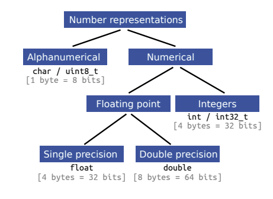
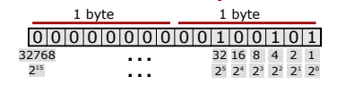
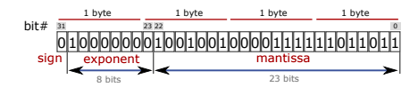
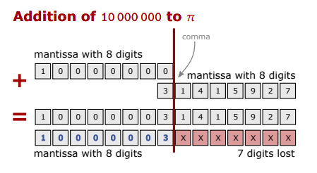
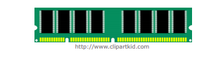
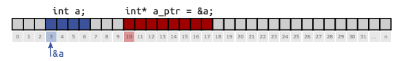
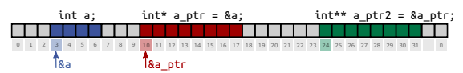
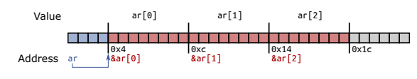

<<<<<<< HEAD
= Bilgisayarlı Görü ve Görüntü İşleme için Modern C ++
:TOC:

== 1. ÖZET

Bu seride 

* Statik değişkenler ve yöntemler ana hatlarıyla(Outline Static variables and methods )
* Hafızadaki sayıların temsili(Representation of numbers in memory )
* Ham C dizileri(Raw C arrays )
* {cpp}'da sahip olmayan işaretçiler(Non-owning pointers in C++)
* Hafızadaki sınıflar(Classes in memory)

örneklerle anlatılmaktadır.

== 2. Statik değişkenler ve yöntemler
* Bir sınıfın statik üye değişkenleri
** Nesne başına değil, sınıf başına tam olarak bir kez bulunur
** Değer, tüm örneklerde eşittir
** *.cpp dosyalarında tanımlanmalıdır
* Bir sınıfın statik üye fonksiyonları
** Bir sınıfın nesnesine sahip değilsiniz
** private üyelere erişebilir ancak bir nesneye ihtiyaç duyar
** Arama için sözdizimi:(Syntax for calling):
*ClassName::MethodName(<params>)*

=== 2.1. Statik değişkenler(Static variables)

[source, cpp]
----
 #include <iostream>
 using std :: cout; using std :: endl;
 struct Counted {
 Counted () { Counted :: count ++; }
 ~Counted () { Counted ::count --; }
 static int count; // Static counter member.
 };
 int Counted :: count = 0; // Definition.
 int main () {
 Counted a, b;
 cout << "Count: " << Counted :: count << endl;
 Counted c;
 cout << "Count: " << Counted :: count << endl;
 return 0;
 }
----

=== 2.2. Statik üye fonksiyonları(Static member functions)

[source, cpp]
----
 #include <math.h>
 #include <iostream>
 using std :: cout; using std :: endl;
 class Point {
 public:
 Point(int x, int y) : x_(x), y_(y) {}
 static float dist(const Point& a, const Point& b) {
 int diff_x = a.x_ - b.x_;
 int diff_y = a.y_ - b.y_;
 return sqrt(diff_x * diff_x + diff_y * diff_y);
 }
 private:
 int x_ = 0; int y_ = 0;
 };
 int main () {
 Point a(2, 2), b(1, 1);
 cout << "Dist is " << Point :: dist(a, b) << endl;
 return 0;
 }
----

== 3. Değişken bildirimini geri çağırma

[source, cpp]
----
int x = 1;
float y = 1.1313f;
----
[TIP]
====
Hafızada sayı nasıl temsil edilir?
====

[TIP]
====
Bir tür ne kadar belleğe ihtiyaç duyar?
====

* Bir tür için bayt sayısını alın:
*sizeof(<type>)*

image::type.png[]

=== 3.1. sizeof() Örneği

[source, cpp]
----
 // machine specific type sizes
 sizeof(bool) == 1 byte;
 sizeof(char) == 1 byte;
 // floating point types
 sizeof(float) == 4 bytes;
 sizeof(double) == 8 bytes;
 sizeof(long double) == 16 bytes;
 // integral data types
 sizeof(short int) == 2 bytes;
 sizeof(unsigned short int) == 2 bytes;
 sizeof(int) == 4 bytes;
 sizeof(unsigned int) == 4 bytes;
 sizeof(long int) == 8 bytes;
 sizeof(unsigned long int) == 8 bytes;
----

=== 3.2. Tam sayı türlerini temsil etme

[source, cpp]
----
 #include <iostream>
 using std :: cout;
 int main () {
 unsigned short int k = 37;
 cout << "sizeof(" << k << ") is " << sizeof(k)
 << " bytes or " << sizeof(k) * 8 << " bits.";
 }
----

[source, cpp]
----
sizeof(37) is 2 bytes or 16 bit
----

==== Hafızada temsil:

*37=0⋅2^15^+ ⋯ + 1⋅2^5^+0⋅2^4^+0⋅2^3^+1⋅2^2^+0⋅2^1^+1⋅2^0^*

=== 3.3. Temsil edilebilir aralıklar

* 2 Byte

** short int  ->     [-2^15^, +2^15^)
** unsigned short int   ->  [0, +2^16^)

* 4 Byte
** int  ->  [-2^31^, +2^31^)
** unsigned int  ->  [0, +2^32^)

* 8 Byte
** long int  ->  [-2^63^, +2^63^)
** unsigned long int  ->  [0, +2^64^)

== 4. Floating point numbers(Kayan nokta sayıları)

[source, C++]
----
 #include <iostream>
 using std :: cout;
 int main( int argc , char *argv [] ) {
 float k = 3.14159;
 cout << "sizeof(" << k << ") is " << sizeof(k)
 << " bytes or " << sizeof(k) * 8 << " bits.";
 }
----

==== Output:

[source, C++]
----
sizeof (3.141590) is 4 bytes or 32 bit
----

=== 4.1. Hafızada temsil

* Bellekte:
** İşaret(Sign) 𝑠 = 0
** Üs(Exponent) 𝑒 = 1⋅2^7^+ 0⋅2^6^+ ⋯ + 0⋅2^0^−127 = 1
** Mantis(Mantissa) 𝑚 = 
** Sayı(Number) 𝑘 = −1^𝑠^⋅ 2^𝑒^⋅__ m__
* Temsil edilebilir aralık:
** binary: ±[1.7 ⋅ 2−^126^, 2.2 ⋅ 2^127^]
** decimal: ±[1.2 ⋅ 10^−38^, 3.4 ⋅ 10^38^]

=== 4.2. float vs. double

* Float ile aynı temsil
* Double float için 4 yerine 8 bayt alır
* Daha Uzun Üs ve Mantissa.
* Üs = float için 8 yerine 11 Bit
* Mantissa = float için 23 yerine 53 Bit

=== 4.3. Neyi temsil edebiliriz?

[width="100%"]
|====================
|VeriTipi(Datatype)|Bellek(Memory)|Aralığı(Interval)
| int   | 4 Byte |  [0, 4.3 ⋅ 10^9^)
|float|4 Byte|[1.18⋅10−^38^,3.4⋅10^38^] 
|====================

* *int:* Her sayı | 𝑥 | ∈ [0, 2^32^) 1'lik artışlarla gösterilebilir 
* *float:* artış, Üs'ün büyüklüğüne bağlıdır!
** Üs: Gösterilebilir aralığın boyutunu tanımlar, 
*8 Bit → [2^−126^, 2^127^] = [1.2 ⋅ 10^−38^, 1.7 ⋅ 10^38^]*
** Mantis: 8 anlamlı basamaklı, 23 Bit uzunluğunda bir sabit oluşturur

=== 4.4. Sınırlı sayıda anlamlı basamak

*Basamakların yok olması*

[source,C++]
----
 #include <cmath>
 #include <iostream>
 using std :: cout; using std :: endl;
 int main () {
 float pi = M_PI;
 float big_number = 1e7;
 cout << "Pi before: " << pi << endl;
 pi += big_number ;
 pi -= big_number ;
 cout << "Pi after: " << pi << endl;
 cout << "Difference: " << M_PI - pi << endl;
 return 0;
 }
----

==== sonuç
[source,C++]
----
Pi before: 3.14159
Pi after: 3
Difference: 0.141593
----

== 5. C tarzı diziler

* std::array, std::vector, std::string
* Dizinin uzunluğu sabittir
* Endeksleme 0 ile başlar!
* Bir dizinin öğeleri sürekli bellekte bulunur.

==== Bildirme(Declaration):

[source, cpp]
----
Type array_name[length];
Type array_name[length] = {n0, n1, n2, ..., nX};
Type array_name[] = { n1, n2, n3};
----

=== 5.1. Diziler basit veri taşıyıcılarıdır

[source, cpp]
----
 int main () {
 int shorts [5] = {5, 4, 3, 2, 1};
 double doubles [10];
 char chars [] = {'h', 'a', 'l', 'l', 'o'};
 shorts [3] = 4;
 chars [1] = 'e';
 chars [4] = chars [2];
 doubles [1] = 3.2;
 }
----

=== 5.2. Diziler ve sizeof ()

* sizeof() of an array is sizeof(<type>) * <array_length>

[source, cpp]
----
 int shortA [5] = {5, 4, 3, 2, 1};
 double longA [4] = {1.0 , 1.1, 1.2, 1.3};
 sizeof(shortA) = 20
 sizeof(shortA) / sizeof(shortA [0]) = 5
 sizeof(longA) = 32
 sizeof(longA) / sizeof(longA [0]) = 4
----

== 6. Çalışma belleği veya RAM

.http://www.clipartsuggest.com/

* Çalışma belleği doğrusal adreslemeye sahiptir
* Her baytın, genellikle onaltılık biçimde sunulan bir adresi vardır, ör. 0x7fffb7335fdc
* Herhangi bir adrese rastgele erişilebilir
* İşaretçi, bellek adreslerini depolamak için bir türdür

== 7. Pointer

* Pointer tipleri *<TYPE>** şeklinde tanımlanır.
* İşaretçilerin bir türü var
* İşaretçi *<TYPE>**  yalnızca <TYPE> türünde bir değişkene işaret edebilir
* Başlatılmamış işaretçiler rastgele bir adresi işaret eder
* İşaretçileri her zaman bir adrese veya nullptr'e ile başlatın

==== Example:

[source,cpp]
1 int* a = nullptr;
2 double* b = nullptr;
3 YourType* c = nullptr;

=== 7.1. Sahip olmayan işaretçiler(Non-owning pointers)

* İşlenmemiş bir işaretçi tarafından işaret edilen bellek, işaretçi kapsam dışına çıktığında kaldırılmıyor
* İşaretçiler hafızaya sahip olabilir veya olmayabilir
* Belleğe sahip olmak, temizlenmesinden sorumlu olmak demektir
* Ham işaretçiler asla hafızaya sahip olmamalıdır(Raw pointers should never own
memory)
* Daha sonra hafızaya sahip olan akıllı işaretçilerden(smart pointers) bahsedeceğiz

=== 7.2. İşaretçiler için adres operatörü

* Operatör & bellekteki değişkenin adresini döndürür
* Dönüş değeri türü 'değer türüne işaretçi' dir

==== Example:

[source,cpp]
 int a = 42;
 int* a_ptr = &a;
 

=== 7.3. Pointer to pointer

==== Example:

[source,cpp]
 int a = 42;
 int* a_ptr = &a;
 int** a_ptr_ptr = &a_ptr;
 

=== 7.4. İşaretçi referans alma

* Operatör *, işaretçinin işaret ettiği değişkenin değerini verir
* Nullptr'nin referansının kaldırılması: Segmentasyon Hatası(Segmentation Fault)
* Birimselleştirilmiş göstericinin referansının kaldırılması: Tanımsız Davranış(Undefined Behavior)

[source,cpp]
----
 #include <iostream>
 using std :: cout; using std :: endl;
 int main () {
 int a = 42;
 int* a_ptr = &a;
 int b = *a_ptr;
 cout << "a = " << a << " b = " << b << endl;
 *a_ptr = 13;
 cout << "a = " << a << " b = " << b << endl;
 return 0;
 }
----

==== Output:

[source, cpp]
 a = 42, b = 42
 a = 13, b = 42
 
=== 7.5. Başlatılmamış işaretçi

[source,cpp]
----
 #include <iostream>
 using std :: cout;
 using std :: endl;
 int main () {
 int* i_ptr; // BAD! Never leave unitialized!
 cout << "ptr address: " << i_ptr << endl;
 cout << "value under ptr: " << *i_ptr << endl;
 i_ptr = nullptr;
 cout << "new ptr address: " << i_ptr << endl;
 cout << "ptr size: " << sizeof(i_ptr) << " bytes";
 cout << " (" << sizeof(i_ptr) * 8 << "bit) " << endl;
 return 0;
 }
----

----
1 ptr address: 0x400830
2 value under ptr: -1991643855
3 new ptr address: 0
4 ptr size: 8 bytes (64 bit)
----
[IMPORTANT]
====
* Her zaman bir değer veya nullptr ile başlat
* Bir nullptr başvurusunun kaldırılması Segmentasyon Hatasına neden olur
* Segmentasyon Hatalarını önlemek için *if* kullanın

[source,cpp]
----
 if(some_ptr ) {
 // only enters if some_ptr != nullptr
 }
 if(! some_ptr) {
 // only enters if some_ptr == nullptr
 }
----
====

== 8. Bellekteki diziler ve işaretçiler

* Dizi öğeleri bellekte süreklidir
* Bir dizinin adı, bir göstericinin takma adıdır:

[source,cpp]
 double ar [3];
 double* ar_ptr = ar;
 double* ar_ptr = &ar [0];

* *[]* Operatörüyle dizi öğelerini alın

[CAUTION]
====
*Dikkatli! Taşma!*

[source,cpp]
----
 #include <iostream>
 int main () {
 int ar[] = {1, 2, 3};
 // WARNING! Iterating too far!
 for (int i = 0; i < 6; i++){
 std :: cout << i << ": value: " << ar[i]
 << "\t addr:" << &ar[i] << std :: endl;
 }
 return 0;
 }
----

----
 0: value: 1 addr :0 x7ffd17deb4e0
 1: value: 2 addr :0 x7ffd17deb4e4
 2: value: 3 addr :0 x7ffd17deb4e8
 3: value: 0 addr :0 x7ffd17deb4ec
 4: value: 4196992 addr :0 x7ffd17deb4f0
 5: value: 32764 addr :0 x7ffd17deb4f4
----
====

=== 8.1. Bellekteki özel nesneler

* Bir nesnenin parçalarının bellekte nasıl saklandığı tam olarak tanımlanmamıştır
* Genellikle sırayla
* Derleyici belleği optimize edebilir

[source,cpp]
----
 class MemoryTester {
 public:
 int i;
 double d;
 void SetData(float data) { data_ = data; }
 float* GetDataAddress () { return &data_; }
 private:
 float data_; // position of types is important
 };
----

==== Ne nerede?

[source,cpp]
----
 #include "class_memory.h"
 #include <iostream >
 using std :: cout; using std :: endl;
 int main () {
 MemoryTester tester;
 tester.i = 1; tester.d = 2; tester.SetData (3);
 cout << "Sizeof tester: " << sizeof(tester) << endl;
 cout << "Address of i: " << &tester.i << endl;
 cout << "Address of d: " << &tester.d << endl;
 cout << "Address of _data: "
 << tester. GetDataAddress () << endl;
 return 0;
 }
----

----
// memory: |i|i|i|i|_|_|_|_|d|d|d|d|d|d|d|d|...
// who is who: | int i |padding| double d |...
----

== Referanslar

=======
= Bilgisayarlı Görü ve Görüntü İşleme için Modern C ++
:TOC:

== 1. ÖZET

Bu seride 

* Statik değişkenler ve yöntemler ana hatlarıyla(Outline Static variables and methods )
* Hafızadaki sayıların temsili(Representation of numbers in memory )
* Ham C dizileri(Raw C arrays )
* {cpp}'da sahip olmayan işaretçiler(Non-owning pointers in C++)
* Hafızadaki sınıflar(Classes in memory)

örneklerle anlatılmaktadır.

== 2. Statik değişkenler ve yöntemler
* Bir sınıfın statik üye değişkenleri
** Nesne başına değil, sınıf başına tam olarak bir kez bulunur
** Değer, tüm örneklerde eşittir
** *.cpp dosyalarında tanımlanmalıdır
* Bir sınıfın statik üye fonksiyonları
** Bir sınıfın nesnesine sahip değilsiniz
** private üyelere erişebilir ancak bir nesneye ihtiyaç duyar
** Arama için sözdizimi:(Syntax for calling):
*ClassName::MethodName(<params>)*

=== 2.1. Statik değişkenler(Static variables)

[source, cpp]
----
 #include <iostream>
 using std :: cout; using std :: endl;
 struct Counted {
 Counted () { Counted :: count ++; }
 ~Counted () { Counted ::count --; }
 static int count; // Static counter member.
 };
 int Counted :: count = 0; // Definition.
 int main () {
 Counted a, b;
 cout << "Count: " << Counted :: count << endl;
 Counted c;
 cout << "Count: " << Counted :: count << endl;
 return 0;
 }
----

=== 2.2. Statik üye fonksiyonları(Static member functions)

[source, cpp]
----
 #include <math.h>
 #include <iostream>
 using std :: cout; using std :: endl;
 class Point {
 public:
 Point(int x, int y) : x_(x), y_(y) {}
 static float dist(const Point& a, const Point& b) {
 int diff_x = a.x_ - b.x_;
 int diff_y = a.y_ - b.y_;
 return sqrt(diff_x * diff_x + diff_y * diff_y);
 }
 private:
 int x_ = 0; int y_ = 0;
 };
 int main () {
 Point a(2, 2), b(1, 1);
 cout << "Dist is " << Point :: dist(a, b) << endl;
 return 0;
 }
----

== 3. Değişken bildirimini geri çağırma

[source, cpp]
----
int x = 1;
float y = 1.1313f;
----
[TIP]
====
Hafızada sayı nasıl temsil edilir?
====

[TIP]
====
Bir tür ne kadar belleğe ihtiyaç duyar?
====

* Bir tür için bayt sayısını alın:
*sizeof(<type>)*

image::type.png[]

=== 3.1. sizeof() Örneği

[source, cpp]
----
 // machine specific type sizes
 sizeof(bool) == 1 byte;
 sizeof(char) == 1 byte;
 // floating point types
 sizeof(float) == 4 bytes;
 sizeof(double) == 8 bytes;
 sizeof(long double) == 16 bytes;
 // integral data types
 sizeof(short int) == 2 bytes;
 sizeof(unsigned short int) == 2 bytes;
 sizeof(int) == 4 bytes;
 sizeof(unsigned int) == 4 bytes;
 sizeof(long int) == 8 bytes;
 sizeof(unsigned long int) == 8 bytes;
----

=== 3.2. Tam sayı türlerini temsil etme

[source, cpp]
----
 #include <iostream>
 using std :: cout;
 int main () {
 unsigned short int k = 37;
 cout << "sizeof(" << k << ") is " << sizeof(k)
 << " bytes or " << sizeof(k) * 8 << " bits.";
 }
----

[source, cpp]
----
sizeof(37) is 2 bytes or 16 bit
----

==== Hafızada temsil:

*37=0⋅2^15^+ ⋯ + 1⋅2^5^+0⋅2^4^+0⋅2^3^+1⋅2^2^+0⋅2^1^+1⋅2^0^*

=== 3.3. Temsil edilebilir aralıklar

* 2 Byte

** short int  ->     [-2^15^, +2^15^)
** unsigned short int   ->  [0, +2^16^)

* 4 Byte
** int  ->  [-2^31^, +2^31^)
** unsigned int  ->  [0, +2^32^)

* 8 Byte
** long int  ->  [-2^63^, +2^63^)
** unsigned long int  ->  [0, +2^64^)

== 4. Floating point numbers(Kayan nokta sayıları)

[source, C++]
----
 #include <iostream>
 using std :: cout;
 int main( int argc , char *argv [] ) {
 float k = 3.14159;
 cout << "sizeof(" << k << ") is " << sizeof(k)
 << " bytes or " << sizeof(k) * 8 << " bits.";
 }
----

==== Output:

[source, C++]
----
sizeof (3.141590) is 4 bytes or 32 bit
----

=== 4.1. Hafızada temsil

* Bellekte:
** İşaret(Sign) 𝑠 = 0
** Üs(Exponent) 𝑒 = 1⋅2^7^+ 0⋅2^6^+ ⋯ + 0⋅2^0^−127 = 1
** Mantis(Mantissa) 𝑚 = 
** Sayı(Number) 𝑘 = −1^𝑠^⋅ 2^𝑒^⋅__ m__
* Temsil edilebilir aralık:
** binary: ±[1.7 ⋅ 2−^126^, 2.2 ⋅ 2^127^]
** decimal: ±[1.2 ⋅ 10^−38^, 3.4 ⋅ 10^38^]

=== 4.2. float vs. double

* Float ile aynı temsil
* Double float için 4 yerine 8 bayt alır
* Daha Uzun Üs ve Mantissa.
* Üs = float için 8 yerine 11 Bit
* Mantissa = float için 23 yerine 53 Bit

=== 4.3. Neyi temsil edebiliriz?

[width="100%"]
|====================
|VeriTipi(Datatype)|Bellek(Memory)|Aralığı(Interval)
| int   | 4 Byte |  [0, 4.3 ⋅ 10^9^)
|float|4 Byte|[1.18⋅10−^38^,3.4⋅10^38^] 
|====================

* *int:* Her sayı | 𝑥 | ∈ [0, 2^32^) 1'lik artışlarla gösterilebilir 
* *float:* artış, Üs'ün büyüklüğüne bağlıdır!
** Üs: Gösterilebilir aralığın boyutunu tanımlar, 
*8 Bit → [2^−126^, 2^127^] = [1.2 ⋅ 10^−38^, 1.7 ⋅ 10^38^]*
** Mantis: 8 anlamlı basamaklı, 23 Bit uzunluğunda bir sabit oluşturur

=== 4.4. Sınırlı sayıda anlamlı basamak

*Basamakların yok olması*

[source,C++]
----
 #include <cmath>
 #include <iostream>
 using std :: cout; using std :: endl;
 int main () {
 float pi = M_PI;
 float big_number = 1e7;
 cout << "Pi before: " << pi << endl;
 pi += big_number ;
 pi -= big_number ;
 cout << "Pi after: " << pi << endl;
 cout << "Difference: " << M_PI - pi << endl;
 return 0;
 }
----

==== sonuç
[source,C++]
----
Pi before: 3.14159
Pi after: 3
Difference: 0.141593
----

== 5. C tarzı diziler

* std::array, std::vector, std::string
* Dizinin uzunluğu sabittir
* Endeksleme 0 ile başlar!
* Bir dizinin öğeleri sürekli bellekte bulunur.

==== Bildirme(Declaration):

[source, cpp]
----
Type array_name[length];
Type array_name[length] = {n0, n1, n2, ..., nX};
Type array_name[] = { n1, n2, n3};
----

=== 5.1. Diziler basit veri taşıyıcılarıdır

[source, cpp]
----
 int main () {
 int shorts [5] = {5, 4, 3, 2, 1};
 double doubles [10];
 char chars [] = {'h', 'a', 'l', 'l', 'o'};
 shorts [3] = 4;
 chars [1] = 'e';
 chars [4] = chars [2];
 doubles [1] = 3.2;
 }
----

=== 5.2. Diziler ve sizeof ()

* sizeof() of an array is sizeof(<type>) * <array_length>

[source, cpp]
----
 int shortA [5] = {5, 4, 3, 2, 1};
 double longA [4] = {1.0 , 1.1, 1.2, 1.3};
 sizeof(shortA) = 20
 sizeof(shortA) / sizeof(shortA [0]) = 5
 sizeof(longA) = 32
 sizeof(longA) / sizeof(longA [0]) = 4
----

== 6. Çalışma belleği veya RAM

.http://www.clipartsuggest.com/

* Çalışma belleği doğrusal adreslemeye sahiptir
* Her baytın, genellikle onaltılık biçimde sunulan bir adresi vardır, ör. 0x7fffb7335fdc
* Herhangi bir adrese rastgele erişilebilir
* İşaretçi, bellek adreslerini depolamak için bir türdür

== 7. Pointer

* Pointer tipleri *<TYPE>** şeklinde tanımlanır.
* İşaretçilerin bir türü var
* İşaretçi *<TYPE>**  yalnızca <TYPE> türünde bir değişkene işaret edebilir
* Başlatılmamış işaretçiler rastgele bir adresi işaret eder
* İşaretçileri her zaman bir adrese veya nullptr'e ile başlatın

==== Example:

[source,cpp]
1 int* a = nullptr;
2 double* b = nullptr;
3 YourType* c = nullptr;

=== 7.1. Sahip olmayan işaretçiler(Non-owning pointers)

* İşlenmemiş bir işaretçi tarafından işaret edilen bellek, işaretçi kapsam dışına çıktığında kaldırılmıyor
* İşaretçiler hafızaya sahip olabilir veya olmayabilir
* Belleğe sahip olmak, temizlenmesinden sorumlu olmak demektir
* Ham işaretçiler asla hafızaya sahip olmamalıdır(Raw pointers should never own
memory)
* Daha sonra hafızaya sahip olan akıllı işaretçilerden(smart pointers) bahsedeceğiz

=== 7.2. İşaretçiler için adres operatörü

* Operatör & bellekteki değişkenin adresini döndürür
* Dönüş değeri türü 'değer türüne işaretçi' dir

==== Example:

[source,cpp]
 int a = 42;
 int* a_ptr = &a;
 

=== 7.3. Pointer to pointer

==== Example:

[source,cpp]
 int a = 42;
 int* a_ptr = &a;
 int** a_ptr_ptr = &a_ptr;
 

=== 7.4. İşaretçi referans alma

* Operatör *, işaretçinin işaret ettiği değişkenin değerini verir
* Nullptr'nin referansının kaldırılması: Segmentasyon Hatası(Segmentation Fault)
* Birimselleştirilmiş göstericinin referansının kaldırılması: Tanımsız Davranış(Undefined Behavior)

[source,cpp]
----
 #include <iostream>
 using std :: cout; using std :: endl;
 int main () {
 int a = 42;
 int* a_ptr = &a;
 int b = *a_ptr;
 cout << "a = " << a << " b = " << b << endl;
 *a_ptr = 13;
 cout << "a = " << a << " b = " << b << endl;
 return 0;
 }
----

==== Output:

[source, cpp]
 a = 42, b = 42
 a = 13, b = 42
 
=== 7.5. Başlatılmamış işaretçi

[source,cpp]
----
 #include <iostream>
 using std :: cout;
 using std :: endl;
 int main () {
 int* i_ptr; // BAD! Never leave unitialized!
 cout << "ptr address: " << i_ptr << endl;
 cout << "value under ptr: " << *i_ptr << endl;
 i_ptr = nullptr;
 cout << "new ptr address: " << i_ptr << endl;
 cout << "ptr size: " << sizeof(i_ptr) << " bytes";
 cout << " (" << sizeof(i_ptr) * 8 << "bit) " << endl;
 return 0;
 }
----

----
1 ptr address: 0x400830
2 value under ptr: -1991643855
3 new ptr address: 0
4 ptr size: 8 bytes (64 bit)
----
[IMPORTANT]
====
* Her zaman bir değer veya nullptr ile başlat
* Bir nullptr başvurusunun kaldırılması Segmentasyon Hatasına neden olur
* Segmentasyon Hatalarını önlemek için *if* kullanın

[source,cpp]
----
 if(some_ptr ) {
 // only enters if some_ptr != nullptr
 }
 if(! some_ptr) {
 // only enters if some_ptr == nullptr
 }
----
====

== 8. Bellekteki diziler ve işaretçiler

* Dizi öğeleri bellekte süreklidir
* Bir dizinin adı, bir göstericinin takma adıdır:

[source,cpp]
 double ar [3];
 double* ar_ptr = ar;
 double* ar_ptr = &ar [0];

* *[]* Operatörüyle dizi öğelerini alın

[CAUTION]
====
*Dikkatli! Taşma!*

[source,cpp]
----
 #include <iostream>
 int main () {
 int ar[] = {1, 2, 3};
 // WARNING! Iterating too far!
 for (int i = 0; i < 6; i++){
 std :: cout << i << ": value: " << ar[i]
 << "\t addr:" << &ar[i] << std :: endl;
 }
 return 0;
 }
----

----
 0: value: 1 addr :0 x7ffd17deb4e0
 1: value: 2 addr :0 x7ffd17deb4e4
 2: value: 3 addr :0 x7ffd17deb4e8
 3: value: 0 addr :0 x7ffd17deb4ec
 4: value: 4196992 addr :0 x7ffd17deb4f0
 5: value: 32764 addr :0 x7ffd17deb4f4
----
====

=== 8.1. Bellekteki özel nesneler

* Bir nesnenin parçalarının bellekte nasıl saklandığı tam olarak tanımlanmamıştır
* Genellikle sırayla
* Derleyici belleği optimize edebilir

[source,cpp]
----
 class MemoryTester {
 public:
 int i;
 double d;
 void SetData(float data) { data_ = data; }
 float* GetDataAddress () { return &data_; }
 private:
 float data_; // position of types is important
 };
----

==== Ne nerede?

[source,cpp]
----
 #include "class_memory.h"
 #include <iostream >
 using std :: cout; using std :: endl;
 int main () {
 MemoryTester tester;
 tester.i = 1; tester.d = 2; tester.SetData (3);
 cout << "Sizeof tester: " << sizeof(tester) << endl;
 cout << "Address of i: " << &tester.i << endl;
 cout << "Address of d: " << &tester.d << endl;
 cout << "Address of _data: "
 << tester. GetDataAddress () << endl;
 return 0;
 }
----

----
// memory: |i|i|i|i|_|_|_|_|d|d|d|d|d|d|d|d|...
// who is who: | int i |padding| double d |...
----

== Referanslar

>>>>>>> fe3be6150d3b2a03dafcbde687e479d82fb25042
https://www.ipb.uni-bonn.de/wp-content/uploads/2018/05/lecture_6.pdf