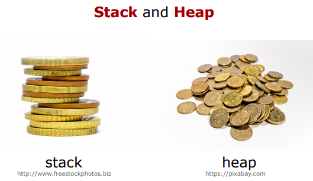
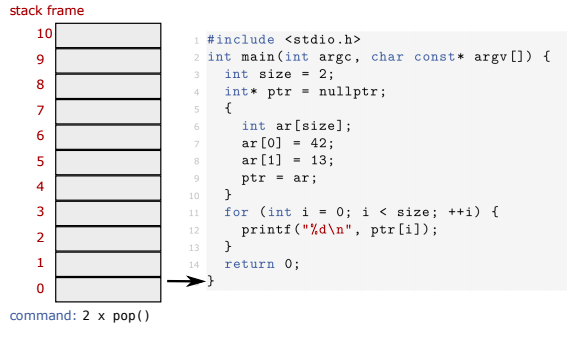

= Bilgisayarlı Görü ve Görüntü İşleme için Modern C ++
:TOC:

== 1. ÖZET

Bu seride 

* İşaretçileri kullanma(Using pointers )
* İşaretçiler çokbiçimlidir(Pointers are polymorphic )
* İşaretçi 'this'(Pointer 'this')
* Const'ı işaretçilerle kullanma(Using const with pointers )
* Yığın ve Yığın(Stack and Heap )
* Bellek sızıntıları ve sarkan işaretçiler(Memory leaks and dangling pointers 
** Bellek sızıntısı(Memory leak)
** Sarkan işaretçi(Dangling pointer )
** RAII

örneklerle anlatılmaktadır.

== 2. İşaretçileri gerçek dünyada kullanma

=== 2.1. Sınıflar için işaretçiler kullanma

* İşaretçiler, özel sınıfların nesnelerine işaret edebilir:

[source, C++]
----
 std :: vector <int> vector_int ;
 std :: vector <int >* vec_ptr = & vector_int ;
 MyClass obj;
 MyClass* obj_ptr = &obj;
----

* -> ile işaretçiden nesne fonksiyonlarını çağırın

[source, C++]
----
 MyClass obj;
 obj.MyFunc ();
 MyClass* obj_ptr = &obj;
 obj_ptr ->MyFunc ();
----

* *obj->Func() ↔ (*obj).Func()*

=== 2.2. İşaretçiler çokbiçimlidir

* İşaretçiler tıpkı referanslar gibidir ancak ek yararlı özelliklere sahiptir:
** Yeniden atanabilir
** 'Hiçbir şey' e işaret edebilir (nullptr)
** Bir vektörde veya bir dizide saklanabilir

=== 2.3. Çokbiçimlilik için işaretçiler kullanın

[source, C++]
----
 Derived derived;
 Base* ptr = &derived;
----

*Örnek:* strateji uygulamak için, strateji arayüzüne bir işaretçi depolayın ve bunu *nullptr* ile başlatın ve yöntemlerini çağırmadan önce ayarlanıp ayarlanmadığını kontrol edin.

[source, C++]
----
 #include <iostream>
 #include <vector>
 using std :: cout;
 struct AbstractShape {
 virtual void Print () const = 0;
 };
 struct Square : public AbstractShape {
 void Print () const override { cout << "Square\n"; }
 };
 struct Triangle : public AbstractShape {
 void Print () const override { cout << "Triangle\n"; }
 };
 int main () {
 std :: vector < AbstractShape *> shapes;
 Square square;
 Triangle triangle;
 shapes. push_back (& square);
 shapes. push_back (& triangle);
 for (const auto* shape : shapes) { shape ->Print (); }
 return 0;
 }
----

=== 2.4. this pointer

* Bir sınıfın veya yapının her nesnesi kendine bir işaretçi tutar
* Bu işaretçiler '**this**' ile çağrılır
* Nesnelerin şunları yapmasına izin verir:
** Kendilerine bir referans döndürün: *return *this;*
** Bir fonksiyon içinde kendilerinin kopyalarını oluşturun 
** Bir üyenin mevcut nesneye ait olduğunu açıkça gösterin: *this-> x ();*

=== 2.5. Const'ı işaretçilerle kullanma

* İşaretçiler bir const değişkenine işaret edebilir:

[source, C++]
----
 // Cannot change value , can reassign pointer.
 const MyType* const_var_ptr = &var;
 const_var_ptr = & var_other ;
----

* İşaretçiler const olabilir:

[source, C++]
----
 // Cannot reassign ponter , can change value.
 MyType* const var_const_ptr = &var;
 var_const_ptr ->a = 10;
----

* İşaretçiler her ikisini de aynı anda yapabilir:

[source, C++]
----
 // Cannot change in any way, read -only.
 const MyType* const const_var_const_ptr = &var;
----
[NOTE]
====
Hangi sabitin neyi ifade ettiğini görmek için sağdan sola doğru okuyun
====

== 3. Stack ve heap

=== 3.1. Bellek yönetimi yapıları

* Çalışma belleği iki bölüme ayrılmıştır:

==== 3.1.1 Stack memory

* *Statik* hafıza
* Kısa süreli depolamaya uygun (scope/kapsam)
* Küçük / sınırlı (8 MB Linux typisch)
* Bellek ayırma hızlıdır
* LIFO ( **L**ast **i**n **F**irst **o**ut -Son Giren İlk Çıkar) yapısı
* *Push* ile yığının üstüne eklenen öğeler
* *Pop* ile üstten kaldırılan öğeler

[source, C++]
----
 #include <stdio.h>
 int main(int argc, char const* argv[] ) {
   int size = 2;
   int* ptr = nullptr;
   {
      int ar[size];
      ar[0] = 42;
      ar[1] = 13;
      ptr = ar;
    }
    for (int i = 0; i < size; ++i){
      printf("%d\n", ptr[i]);
     }
     return 0;
  }
----

==== 3.1.2 Heap memory 

image::images/heap.png[]

* *Dinamik* hafıza
* Uzun süre kullanılabilir (program runtime/program çalışma süresi)
* *new* ve *delete* ile ham değişiklikler mümkündür (genellikle bir sınıf içinde kapsüllenir)
* Tahsis, yığın tahsislerinden daha yavaştır

=== 3.2. new ve new[] Operatörleri
* Kullanıcı bellek ayırmayı denetler (güvenli değil)
* Verileri tahsis etmek için *new* kullanın:

[source, C++]
----
 // pointer variable stored on stack
 int* int_ptr = nullptr;
 // 'new' returns a pointer to memory in heap
 int_ptr = new int;

 // also works for arrays
 float* float_ptr = nullptr;
 // 'new' returns a pointer to an array on heap
 float_ptr =
Akıllı işaretçiler kullanmayı tercih edin!
 new float[number ];
----

* *new*, heap daki değişkenin adresini döndürür

[TIP]
====
*Akıllı işaretçiler(smart pointers)* kullanmayı tercih edin!
====
 
=== 3.3. delete ve delete[] Operatörleri

* Bellek otomatik olarak serbest bırakılmaz!
* Kullanıcı hafızayı boşaltmayı hatırlamalıdır
* Belleği boşaltmak için delete veya delete[] kullanın:

[source, C++]
----
 int* int_ptr = nullptr;
 int_ptr = new int;
 // delete frees memory to which the pointer points
 delete int_ptr;

 // also works for arrays
 float* float_ptr = nullptr;
 float_ptr = new float[number ];
 // make sure to use 'delete[]' for arrays
 delete[] float_ptr ;
----

[TIP]
====
*Akıllı işaretçiler(smart pointers)* kullanmayı tercih edin!
====

===== Example: heap memory

[source, C++]
----
 #include <iostream>
 using std :: cout; using std :: endl;
 int main () {
 int size = 2; int* ptr = nullptr;
 {
 ptr = new int[size ];
 ptr [0] = 42; ptr [1] = 13;
 } // End of scope does not free heap memory!
 // Correct access , variables still in memory.
 for (int i = 0; i < size; ++i) {
 cout << ptr[i] << endl;
 }
 delete[] ptr; // Free memory.
 for (int i = 0; i < size; ++i) {
 // Accessing freed memory. UNDEFINED!
 cout << ptr[i] << endl;
 }
 return 0;
 }
----

== 4. Bellek ile ilgili olası sorunlar

=== 4.1. Bellek sızıntısı

* Dikkatli olmazsak Heap hafıza ile çalışırken meydana gelebilir
* **Bellek sızıntısı**: Yığın(heap) erişiminde ayrılan ve kaybedilen bellek

.Bellek sızıntısı (delete)
[source, C++]
----
 #include <iostream>
 using std :: cout; using std :: endl;
 int main () {
 double *ptr_1 = NULL;
 double *ptr_2 = NULL;
 int size = 10;
 // Allocate memory for two arrays on the heap.
 ptr_1 = new double[size ];
 ptr_2 = new double[size ];
 cout << "1: " << ptr_1 << " 2: " << ptr_2 << endl;
 ptr_2 = ptr_1;
 // ptr_2 overwritten , no chance to access the memory.
 cout << "1: " << ptr_1 << " 2: " << ptr_2 << endl;
 delete[] ptr_1;
 delete[] ptr_2;
 return 0;
 }
----

.Error: double free or corruption
----
1 ptr_1: 0x10a3010 , ptr_2: 0x10a3070
2 ptr_1: 0x10a3010 , ptr_2: 0x10a3010
3 *** Error: double free or corruption (fasttop): 0
x00000000010a3010 ***
----

* 0x10a3070 adresindeki bellek asla serbest bırakılmaz
* Bunun yerine, 0x10a3010'un altındaki belleği serbest bırakmayı dener, ikinci kez
* Belleği iki kez boşaltmak bir hatadır

.Bellek sızıntısı örneği
[source, C++]
----
 #include <iostream>
 #include <cmath>
 #include <algorithm>
 using std :: cout; using std :: endl;
 int main () {
 double *data = nullptr;
 size_t size = pow (1024 , 3) / 8; // Produce 1GB
 for (int i = 0; i < 5; ++i) {
 // Allocate memory for the data.
 data = new double[size ];
 std :: fill(data , data + size , 1.23);
 // Do some important work with the data here.
 cout << "Iteration: " << i << " done!" << endl;
 }
 // This will only free the last allocation!
 delete[] data;
 int unused; std :: cin >> unused; // Wait for user.
 return 0;
 }
----

* Hafızamız tükenirse bir std :: bad_alloc hatası atılır
* Bu örneği çalıştırırken dikkatli olun, her şey yavaşlayabilir

[source, C++]
----
1 Iteration : 0 done!
2 Iteration : 1 done!
3 Iteration : 2 done!
4 Iteration : 3 done!
5 terminate called after throwing an instance of 'std ::
bad_alloc '
6 what (): std :: bad_alloc
----

=== 4.2. Sarkan işaretçi(Dangling pointer)

[source, C++]
----
 int* ptr_1 = some_heap_address ;
 int* ptr_2 = some_heap_address ;
 delete ptr_1;
 ptr_1 = nullptr;
 // Cannot use ptr_2 anymore! Behavior undefined!
----

* **Sarkan İşaretçi**: serbest bırakılmış bir belleğe işaretçi
* Bunu bir hafıza sızıntısının tersi olarak düşünün
* Sarkan bir işaretçinin referansının kaldırılması tanımsız davranışa neden olur

.Sarkan işaretçi örneği
[source, C++]
----
 #include <iostream>
 using std :: cout; using std :: endl;
 int main () {
 int size = 5;
 int *ptr_1 = new int[size ];
 int *ptr_2 = ptr_1; // Point to same data!
 ptr_1 [0] = 100; // Set some data.
 cout << "1: " << ptr_1 << " 2: " << ptr_2 << endl;
 cout << "ptr_2[0]: " << ptr_2 [0] << endl;
 delete[] ptr_1; // Free memory.
 ptr_1 = nullptr;
 cout << "1: " << ptr_1 << " 2: " << ptr_2 << endl;
 // Data under ptr_2 does not exist anymore!
 cout << "ptr_2[0]: " << ptr_2 [0] << endl;
 return 0;
 }
----

==== 4.2.1. Fonksiyonlarda kullanıldığında daha da kötüsü

[source, C++]
----
 #include <stdio.h>
 // data processing
 int* GenerateData (int size);
 void UseDataForGood (const int* const data , int size);
 void UseDataForBad (const int* const data , int size);
 int main () {
 int size = 10;
 int* data = GenerateData (size);
 UseDataForGood (data , size);
 UseDataForBad (data , size);
 // Is data pointer valid here? Should we free it?
 // Should we use 'delete[]' or 'delete '?
 delete[] data; // ?????????????
 return 0;
 }
----

=== 4.3. Bellek sızıntısı veya sarkan işaretçi

[source, C++]
----
 void UseDataForGood (const int* const data , int size) {
 // Process data , do not free. Leave it to caller.
 }
 void UseDataForBad (const int* const data , int size) {
 delete[] data; // Free memory!
 data = nullptr; // Another problem - this does nothing!
 }
----

[NOTE]
====
* Hafızayı kimse serbest bırakmadıysa *hafıza sızıntısı*
* Biri bir işlevdeki belleği serbest bıraktıysa, *Sarkan İşaretçi*
====

=== 4.4. RAII

* Kaynak Tahsisi Başlatmadır(**R**esource **A**llocation **I**s **I**nitialization.).
* Yeni nesne → bellek ayır(New object → allocate memory)
* Nesneyi kaldır → boş hafıza(Remove object → free memory)
* Nesneler verilerinin sahibidir!

[source, C++]
----
 class MyClass {
 public:
 MyClass () { data_ = new SomeOtherClass ; }
 ~MyClass () {
 delete data_;
 data_ = nullptr;
 }
 private:
 SomeOtherClass * data_;
 };
----
[IMPORTANT]
====
Yine de MyClass nesnesini kopyalayamıyorum !!!
====

[source, C++]
----
 struct SomeOtherClass {};
 class MyClass {
 public:
 MyClass () { data_ = new SomeOtherClass ; }
 ~MyClass () {
 delete data_;
 data_ = nullptr;
 }
 private:
 SomeOtherClass * data_;
 };
 int main () {
 MyClass a;
 MyClass b(a);
 return 0;
 }
----

[source, C++]
----
*** Error in `raii_example ':
double free or corruption : 0 x0000000000877c20 ***
----

==== 4.4.1. Sığ ve derin kopya

* **Sığ kopya**: verileri değil, yalnızca işaretçileri kopyalayın
* **Derin kopya**: verileri kopyalayın, yeni işaretçiler oluşturun
* Varsayılan kopya oluşturucu ve atama operatörü yüzeysel kopyalamayı uygular
* RAII + sığ kopya → sarkan işaretçi
* RAII + Hep ya da Hiçbir Şey Kuralı → doğru

[TIP]
====
*Akıllı işaretçiler(smart pointers)* kullanmayı tercih edin!
====

== Referanslar

https://www.ipb.uni-bonn.de/wp-content/uploads/2018/05/lecture_7.pdf