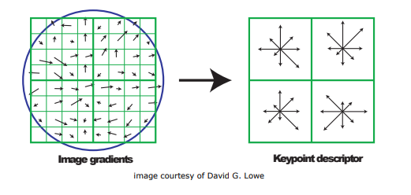

= Bilgisayarlı Görü ve Görüntü İşleme için Modern C ++
:TOC:

== 1. ÖZET

Bu seride 

* Genel Programlama(Generic programming)
** Template functions
** Template classes
* Yineleyiciler(Iterators)
* İstisnalarla hata işleme(Error handling)
* Program giriş parametreleri(Program input parameters)
* OpenCV
** cv::Mat
** cv::Mat I/O
** SIFT Extraction
** FLANN in OpenCV
** OpenCV with CMake 

örneklerle anlatılmaktadır.

== 2. Genel Programlama(Generic programming)

Jenerikler, türün (Integer, String, … vb ve kullanıcı tanımlı türler) metodlara, sınıflara ve interface'lere bir parametre olmasına izin verme fikridir. Örneğin, jenerikler kullanılarak dizi, map vb. çok verimli bir şekilde kullanılabilen sınıflar. Bunları her tür için kullanabiliriz.

Genel Programlama yöntemi, kodun verimliliğini artırmak için uygulanmaktadır. Genel Programlama, programcının tüm veri türleriyle çalışacak genel bir algoritma yazmasını sağlar. Veri türü bir tamsayı, dizge veya karakter ise farklı algoritmalar oluşturma ihtiyacını ortadan kaldırır.

*Genel Programlamanın avantajları şunlardır:*

* Kod Yeniden Kullanılabilirliği
* Fonksiyonun Aşırı Yüklenmesini(Overloading) Önleyin
* Bir kez yazıldıktan sonra birden çok kez ve durumlarda kullanılabilir.

Jenerikler, Şablonlar kullanılarak C{plus}{plus} 'da uygulanabilir. Şablon, C++ 'da basit ama çok güçlü bir araçtır. Basit fikir, veri türünü parametre olarak iletmektir, böylece farklı veri türleri için aynı kodu yazmamız gerekmez. Örneğin, bir yazılım şirketinin farklı veri türleri için sort () öğesine ihtiyacı olabilir. Birden çok kodu yazmak ve sürdürmek yerine, bir sort () yazabilir ve veri türünü parametre olarak geçirebiliriz.

=== 2.1. Şablon Kullanan Genel Fonksiyonlar(Generic Functions using Template):
* Genel programlama anahtar kelime olarak *template* kullanır

[source, C++]
----
 template <typename T, typename S>
 T awesome_function (const T& var_t , const S& var_s) {
 // some dummy implementation
 T result = var_t;
 return result;
 }
----

* T ve S herhangi bir tür olabilir:
** Yapılandırılabilir kopyayı(Copy constructable)
** Atanabilir(Assignable)
** Tanımlanır (özel sınıflar için)

* Veri türü derleyici tarafından belirlenemiyorsa, onu kendimiz tanımlamalıyız

[source, C++]
----
 // Function definition.
 template <typename T>
 T DummyFuncion () {
 T result;
 return result;
 }
 // use it in main function
 int main(int argc , char const *argv []) {
 DummyFuncion <int >();
 DummyFuncion <double >();
 return 0;
 }
----

* Farklı veri türleri için kullanılabilecek genel bir fonksiyon yazıyoruz. Fonksiyon şablonlarının örnekleri sort (), max (), min (), printArray () şeklindedir.

[source, C++]
----
#include <iostream> 
using namespace std; 

// One function works for all data types. 
// This would work even for user defined types 
// if operator '>' is overloaded 
template <typename T> 

T myMax(T x, T y) 
{ 
	return (x > y) ? x : y; 
} 

int main() 
{ 

	// Call myMax for int 
	cout << myMax<int>(3, 7) << endl; 

	// call myMax for double 
	cout << myMax<double>(3.0, 7.0) << endl; 

	// call myMax for char 
	cout << myMax<char>('g', 'e') << endl; 

	return 0; 
} 
----

=== 2.2. Şablon Kullanan Genel Sınıf(Generic Class using Template):

Fonksiyon şablonları gibi, sınıf şablonları da bir sınıf veri türünden bağımsız bir şey tanımladığında kullanışlıdır. LinkedList, binary tree, Stack, Queue, Array vb. Sınıflar için faydalı olabilir.

Aşağıda, template Array sınıfının basit bir örneği verilmiştir.

[source, C++]
----
#include <iostream> 
using namespace std; 

template <typename T> 
class Array { 
private: 
	T* ptr; 
	int size; 

public: 
	Array(T arr[], int s); 
	void print(); 
}; 

template <typename T> 
Array<T>::Array(T arr[], int s) 
{ 
	ptr = new T[s]; 
	size = s; 
	for (int i = 0; i < size; i++) 
		ptr[i] = arr[i]; 
} 

template <typename T> 
void Array<T>::print() 
{ 
	for (int i = 0; i < size; i++) 
		cout << " " << *(ptr + i); 
	cout << endl; 
} 

int main() 
{ 
	int arr[5] = { 1, 2, 3, 4, 5 }; 
	Array<int> a(arr, 5); 
	a.print(); 
	return 0; 
} 

----

[source, C++]
----
 template <class T>
 class MyClass {
 public:
 MyClass(const T& smth) : smth_(smth) {}
 private:
 T smth_;
 };
 int main(int argc , char const* argv []) {
 MyClass <int> my_object (10);
 MyClass <double > my_double_object (10.0);
 return 0;
 }
----

=== 2.3. Çok tipli Jeneriklerle çalışma(Working with multi-type Generics):

Şablonlara argüman olarak birden fazla veri türü aktarabiliriz. Aşağıdaki örnek aynı şeyi göstermektedir.

[source, C++]
----
#include <iostream> 
using namespace std; 

template <class T, class U> 
class A { 
	T x; 
	U y; 

public: 
	A() 
	{ 
		cout << "Constructor Called" << endl; 
	} 
}; 

int main() 
{ 
	A<char, char> a; 
	A<int, double> b; 
	return 0; 
} 

----

[source, C++]
----
 // Function definition.
 template <typename T>
 T DummyFuncion () {
 T result;
 return result;
 }
 template <>
 int DummyFuncion () {
 return 42;
 }
 int main () {
 DummyFuncion <int >();
 DummyFuncion <double >();
 return 0;
 }
----

=== 2.4. Şablon meta programlama(Template meta programming)
* Meta programlama için şablonlar kullanılır
* Derleyici, kullanmak istediğimiz sınıflara göre genel sınıfların somut örneklerini oluşturacaktır.
* MyClass <int> ve MyClass <float> oluşturursak, derleyici şablon parametresi yerine uygun türlerle iki farklı sınıf oluşturacaktır.

=== 2.5. Şablon sınıfları üstbilgileri / kaynağı(Template classes headers/source)
* Somut şablon sınıfları, derleme zamanında başlatılır.
* Bağlayıcı(Linker) uygulama hakkında bilgi sahibi değil
* Şablon sınıfları için üç seçenek vardır:
** Başlık dosyalarında beyan edin ve tanımlayın
** *NAME.h* dosyasında bildirin, *NAME.hpp* dosyasına uygulayın, NAME.h'nin sonuna *#include <NAME.hpp>* ekleyin(Declare in NAME.h file, implement in NAME.hpp file,
add #include <NAME.hpp> in the end of NAME.h)
** *.h* dosyasında bildirin, **.cpp* dosyasında uygulayın, *.cpp'nin sonuna, kullanmayı beklediğiniz türler için açık örnekleme ekleyin(Declare in *.h file, implement in *.cpp file, in the end of the *.cpp add explicit instantiation for types you expect to use)

[NOTE]
====
Bununla ilgili daha fazlasını okuyun:
http://en.cppreference.com/w/cpp/language/class_template[class_template]

http://www.drdobbs.com/moving-templates-out-of-header-files/184403420[moving-templates-out-of-header-files]
====

== 3. Yineleyiciler(Iterators)

STL, kapsayıcılardaki verilere erişmek için yineleyiciler kullanır

* Yineleyiciler, işaretleyicilere(pointers) benzer
* Kapsayıcılar arasında hızlı gezinmeye izin ver
* STL'deki çoğu algoritma yineleyiciler kullanır
* **iter* ile geçerli öğeye erişin
* *->* kullanır, İşaretçiler gibi
* Kapsayıcı *iter++* 'da sonraki öğeye git
* Döngüler için aralık tabanlı tercih et
* Yineleyicileri *==*, *!=*, *<* İle karşılaştırın
* Önceden tanımlanmış yineleyiciler: *obj.begin(), obj.end()*

[source, C++]
----
 #include <iostream>
 #include <map>
 #include <vector>
 using namespace std;
 int main () {
 // Vector iterator.
 vector <double > x = {{1, 2, 3}};
 for (auto it = x.begin (); it != x.end (); ++it) {
 cout << *it << endl;
 }
 // Map iterators
 map <int, string > m = {{1, "hello"}, {2, "world"}};
 map <int, string >:: iterator m_it = m.find (1);
 cout << m_it ->first << ":" << m_it ->second << endl;
 if (m.find (3) == m.end ()) {
 cout << "Key 3 was not found\n";
 }
 return 0;
 }
----

== 4. İstisnalarla hata işleme(Error handling)

* We can *“throw”* an exception if there is
an error(Bir hata varsa bir istisna 'atabiliriz')
* STL, istisnaları temsil eden sınıfları tanımlar. Temel sınıf: *exception*
* İstisnaları kullanmak için: *#include <stdexcept>*
* An exception can be *‘‘caught’’* at any point
of the program *(try - catch)* and even
*‘‘thrown’’* further **(throw)**(Bir istisna, programın herhangi bir noktasında 'yakalanabilir' (dene - yakala) ve hatta daha da 'atılabilir' (fırlat))
* Bir istisnanın kurucusu, parametre olarak bir dize hata mesajı alır
* Bu dizge bir üye fonksiyonu aracılığıyla çağrılabilir *what()*

=== 4.1. throw exceptions

.Runtime Error:
[source, C++]
----
 // if there is an error
 if (badEvent ) {
 string msg = "specific error string";
 // throw error
 throw runtime_error (msg);
 }
 ... some cool code if all ok ...
----

Mantık Hatası(Logic Error): kullanıcının yaptığı mantıksal bir hata

[source, C++]
----
throw logic_error (msg);
----

=== 4.2. catch exceptions
* Bir istisna beklersek, bunu 'yakalayabiliriz'/ *‘‘caught’’*. 
* İstisnaları yakalamak için dene - yakala/ *(try - catch)* özelliğini kullanın

[source, C++]
----
 try {
 // some code that can throw exceptions z.B.
 x = someUnsafeFunction (a, b, c);
 }
 // we can catch multiple types of exceptions
 catch ( runtime_error &ex ) {
 cerr << "Runtime error: " << ex.what () << endl;
 } catch ( logic_error &ex ) {
 cerr << "Logic error: " << ex.what () << endl;
 } catch ( exception &ex ) {
 cerr << "Some exception: " << ex.what () << endl;
 } catch ( ... ) { // all others
 cerr << "Error: unknown exception" << endl;
 }
----

===== Sezgi
* Yalnızca 'istisnai davranış' için kullanılır
* Genellikle yanlış parametre bir istisnaya yol açtığında kullanılır
* https://google.github.io/styleguide/cppguide.html#Exceptions[GOOGLE-STYLE] İstisnaları kullanmayın
* http://www.cplusplus.com/reference/exception/[exception]

== 5.  Program giriş parametreleri(Program input parameters)
* main fonksiyon bildiriminden kaynaklanır
* binary argüman aktarmaya izin verir
* *int main(int argc, char const *argv[]);*
* **argc** -> Giriş parametrelerinin sayısını tanımlar
* **argv** -> Bir string parametreleri dizisidir
* Varsayılan olarak:
** argc == 1
** argv == "<binary_path>"

[source, C++]
----
 #include <iostream>
 #include <string>
 using namespace std;
 int main(int argc , char const *argv []) {
 cout << "Got " << argc << " params\n";
 string program_name = argv [0];
 cout << "Program: " << program_name << endl;
 for (int i = 1; i < argc; ++i) {
 cout << "Param: " << argv[i] << endl;
 }
 return 0;
 }
----

=== 5.1. Tür takma adı için kullanma(Using for type aliasing)
* Var olanlardan yeni türler bildirmek ve tür takma adları oluşturmak için *using* kelimesini kullanın
* Basic syntax: using NewType = OldType;
* *using* çok yönlü bir kelimedir
* Fonksiyonların dışında kullanıldığında yeni bir tür takma adı bildirir
* Fonksiyonlarda kullanıldığında, geçerli kapsamda bulunan türde bir takma ad oluşturur
* http://en.cppreference.com/w/cpp/language/type_alias[type_alias]

.Using for type aliasing
[source, C++]
----
 #include <array >
 #include <memory >
 template <class T, int SIZE >
 struct Image {
 // Can be used in classes.
 using Ptr = std :: unique_ptr <Image <T, SIZE >>;
 std ::array <T, SIZE > data;
 };
 // Can be combined with "template".
 template <int SIZE >
 using Imagef = Image <float , SIZE >;
 int main () {
 // Can be used in a function for type aliasing.
 using Image3f = Imagef <3>;
 auto image_ptr = Image3f :: Ptr(new Image3f);
 return 0;
 }
----

== 6. OpenCV

* Görüntü İşleme için popüler kütüphanedir.
* OpenCV version 2 nin küçük bir kısmını kullanacağız
* OpenCV'de bulunan tüm işlevleri kullanmak için *#include <opencv2/opencv.hpp>* tanımlanır
* Namespace *cv::*
* Daha fazla burada:: http://opencv.org/

=== 6.1. Veri tipleri

* OpenCV kendi türlerini kullanır
* OpenCV, doğru türü seçmeniz konusunda size güveniyor
* Türlerin isimleri kalıbı takip eder

*CV_<bit_count><itentifier><num_of_channels>*

* Örnek: RGB görüntüsü **CV_8UC3**:
RGB için 3 kanallı 8-bit işaretsiz karakter
* Örnek: Gri tonlamalı görüntü **CV_8UC1**'dir: yoğunluk için tek 8 bitlik işaretsiz karakter
* *DataType* kullanmak daha iyidir
* Örnek: *DataType <uint> :: type == CV_8UC1*

=== 6.2. Temel Matris Türü
* ‘‘Matrix’’ için her görüntü bir *cv::Mat*
* *Mat image(rows, cols, DataType, Value);*
* *Mat_<T> image(rows, cols, Value);*
* *zeros* ile başlat:

[source,C++]
----
 cv:: Mat image = cv:: Mat :: zeros (10, 10, CV_8UC3);
 using Matf = cv::Mat_ <float >;
 Matf image_float = Matf :: zeros (10, 10);

----
* *image.type();* ile tür tanımlayıcıyı alın
* *image.rows, image.cols* ile boyut alın
* *I/O - G/Ç:*
** *imread* ile resmi oku
** *imwrite* ile resim yaz
** *imshow* ile resmi göster
** Uzantıdan I/O - G/Ç yöntemini algılar

=== 6.3. cv::Mat paylaşılan bir göstericidir(cv::Mat is a shared pointer)
* *std::shared_ptr* kullanmaz, ancak aynı referans sayma ilkesini izler

[source,C++]
----
 #include <opencv2/opencv.hpp>
 #include <iostream>
 int main () {
 using Matf = cv::Mat_ <float >;
 Matf image = Matf :: zeros (10, 10);
 Matf image_no_copy = image; // Does not copy!
 image_no_copy .at <float >(5, 5) = 42.42f;
 std :: cout << image.at <float >(5, 5) << std :: endl;
 Matf image_copy = image.clone (); // Copies image.
 image_copy .at <float >(1, 1) = 42.42f;
 std :: cout << image.at <float >(1, 1) << std :: endl;
 }
----

[source,C++]
----
1 c++ -std=c++11 -o copy copy.cpp \
2 `pkg -config --libs --cflags opencv `
----

=== 6.4. imread
* Dosyadan resmi oku
* Mat imread(const string& file, int mode=1)
* Farklı modlar:
** Değişmedi: *CV_LOAD_IMAGE_UNCHANGED < 0*
** 1 kanal: *CV_LOAD_IMAGE_GRAYSCALE == 0*
** 3 kanal: *CV_LOAD_IMAGE_COLOR> 0*

[source,C++]
----
 #include <opencv2/opencv.hpp>
 #include <iostream>
 using namespace cv;
 int main () {
 Mat i1 = imread("logo_opencv.png",
 CV_LOAD_IMAGE_GRAYSCALE );
 Mat_ <uint8_t > i2 = imread("logo_opencv.png",
 CV_LOAD_IMAGE_GRAYSCALE );
 std :: cout << (i1.type () == i2.type ()) << std :: endl;
 return 0;
 } 
----

=== 6.5. imwrite
* Resmi dosyaya yaz
* Uzantıdan format tahmin ediliyor
* *bool imwrite(const string& file,
const Mat& img);*

[source,C++]
----
 #include <opencv2/core/core.hpp>
 #include <opencv2/highgui/highgui.hpp>
 int main () {
 cv:: Mat image = cv:: imread("logo_opencv.png",
 CV_LOAD_IMAGE_COLOR );
 cv:: imwrite("copy.jpg", image);
 return 0;
 }
----

=== 6.6. Float görüntüleri * .exr dosyalarına yazın
* Kayan noktalı görüntüleri depolarken OpenCV, değerlerin [0, 1] aralığında olmasını bekler
* Rasgele değerleri depolarken değerler kesilebilir
* Bunu önlemek için * .exr dosyalarına kaydedin
* Bu dosyalar, değerleri olduğu gibi saklayacak ve okuyacaktır.

.Float images I / O örneği
[source,C++]
----
 #include <iostream>
 #include <opencv2/opencv.hpp>
 #include <string>
 int main () {
 using Matf = cv::Mat_ <float>;
 Matf image = Matf :: zeros (10, 10);
 image.at <float >(5, 5) = 42.42f;
 std :: string f = "test.exr";
 cv:: imwrite(f, image);
 Matf copy = cv:: imread(f, CV_LOAD_IMAGE_UNCHANGED );
 std :: cout << copy.at <float >(5, 5) << std :: endl;
 return 0;
 }
----

[TIP]
====
 Bunun yerine png resimleri kullanırken ne olacağını deneyin
====

=== 6.7. imshow
* Görüntüyü ekranda göster
* Görüntüyü görüntülemek için bir pencereye ihtiyaç vardır
* *void imshow(const string& window_name,
const Mat& mat)*

[source,C++]
----
 #include <opencv2/opencv.hpp>
 int main () {
 cv:: Mat image = cv:: imread("logo_opencv.png",
 CV_LOAD_IMAGE_COLOR );
 std :: string window_name = "Window name";
 // Create a window.
 cv:: namedWindow (window_name , cv:: WINDOW_AUTOSIZE );
 cv:: imshow(window_name , image); // Show image.
 cv:: waitKey (); // Don't close window instantly.
 return 0;
 }
----

=== 6.8. OpenCV vektör türü(OpenCV vector type)
* OpenCV vektör türü: *cv::Vec<Type, SIZE>*
* Birçok tip mevcut: *Vec3f, Vec3b, vb.*
* Çok boyutlu görüntülerde pikseller için kullanılır: *mat.at<Vec3b>(row, col);*

[source,C++]
----
 #include <opencv2/opencv.hpp >
 #include <iostream >
 using namespace cv;
 int main () {
 Mat mat = Mat :: zeros (10, 10, CV_8UC3);
 std :: cout << mat.at <Vec3b >(5, 5) << std :: endl;
 Mat_ <Vec3f > matf3 = Mat_ <Vec3f >:: zeros (10, 10);
 std :: cout << matf3.at <Vec3f >(5, 5) << std :: endl;
 }
----

[WARNING]
====
 Türleri karıştırmak acı vericidir!
 OpenCV türü seçmeniz için size güveniyor
 Bu, hatalara neden olabilir
 OpenCV, cv :: Mat'ta depolanan baytları  kullanıcının sorduğu türe göre yorumlar (reinterpret_cast'e benzer)
 Doğru türleri kullandığınızdan emin olun!
 
[source,C++]
----
 #include <opencv2/opencv.hpp>
 int main () {
 cv:: Mat image = cv:: Mat :: zeros (800 , 600, CV_8UC3);
 std :: string window_name = "Window name";
 cv:: namedWindow (window_name , cv:: WINDOW_AUTOSIZE );
 cv:: imshow(window_name , image);
 cv:: waitKey ();
 for (int r = 0; r < image.rows; ++r) {
 for (int c = 0; c < image.cols; ++c) {
 // WARNING! WRONG TYPE USED!
 image.at <float >(r, c) = 1.0f;
 }
 }
 cv:: imshow(window_name , image);
 cv:: waitKey ();
 return 0;
 }
----
 
====

=== 6.9. SIFT Açıklayıcıları(SIFT Descriptors)
* SIFT: **S**cale **I**nvariant **F**eature **T**ransform(SIFT: Ölçek Değişmez Unsur Dönüşümü)
* Popüler özellikler: aydınlatma, döndürme ve çevirme değişmez (bir dereceye kadar)

=== 6.10. OpenCV ile SIFT Ekstraksiyonu
* **SiftFeatureDetector**, anahtar noktaları tespit etmek için
* *SiftDescriptorExtractor* anahtar noktalarında tanımlayıcıları hesaplamak için

[source,C++]
----
 // Detect key points.
 SiftFeatureDetector detector;
 vector <KeyPoint > keypoints ;
 detector.detect(input , keypoints );
 // Show the keypoints on the image.
 Mat image_with_keypoints ;
 drawKeypoints (input , keypoints , image_with_keypoints );
 // Extract the SIFT descriptors.
 SiftDescriptorExtractor extractor ;
 extractor .compute(input , keypoints , descriptors );
----

=== 6.11. OpenCV'de FLANN
* FLANN: **F**ast **L**ibrary for **A**pproximate
**N**earest **N**eighbors(FLANN: Yaklaşık En Yakın Komşular için Hızlı Kitaplık)
* K-d ağacı inşa et, orada komşu ara(build K-d tree, search for neighbors there)

[source,C++]
----
 // Create a kdtree for searching the data.
 cv:: flann :: KDTreeIndexParams index_params ;
 cv:: flann :: Index kdtree(data , index_params );
 ...
 // Search the nearest vector to some query
 int k = 1;
 Mat nearest_vector_idx (1, k, DataType <int >:: type);
 Mat nearest_vector_dist (1, k, DataType <float >:: type);
 kdtree. knnSearch (query , nearest_vector_idx ,
 nearest_vector_dist , k);
----

=== 6.12. CMake ile OpenCV 2
* OpenCV 2'yi sisteme yükleyin

[source,bash]
----
1 sudo add -apt - repository ppa:xqms/opencv -nonfree
2 sudo apt update
3 sudo apt install libopencv -dev libopencv -nonfree -dev
----

* Find_package kullanarak bul (OpenCV 2 GEREKLİ)

[source,bash]
----
1 find_package(OpenCV 2 REQUIRED )
----

* $ {OpenCV_INCLUDE_DIRS} dahil et
* $ {OpenCV_LIBS} ile bağlantı

[source,C++]
----
 add_library(some_lib some_lib_file .cpp)
 target_link_libraries(some_lib ${OpenCV_LIBS})
 add_executable( some_program some_file .cpp)
 target_link_libraries( some_program ${OpenCV_LIBS})
----

=== 6.13. Ek OpenCV bilgileri
* OpenCV sürüm 2 kullanıyoruz
* 3. sürümü çalıştırmak hatalara yol açacaktır
* SIFT ve FLANN kullanımı hakkında ek bilgi içeren örnek proje burada bulunabilir:
https://gitlab.igg.uni-bonn.de/teaching/example_opencv

== Referanslar

Generic programming:
https://www.geeksforgeeks.org/generics-in-c/

Macros:
http://en.cppreference.com/w/cpp/preprocessor/replace

Lambda expressions:
http://en.cppreference.com/w/cpp/language/lambda

OpenCV SIFT:
https://docs.opencv.org/2.4/modules/nonfree/doc/feature_detection.html